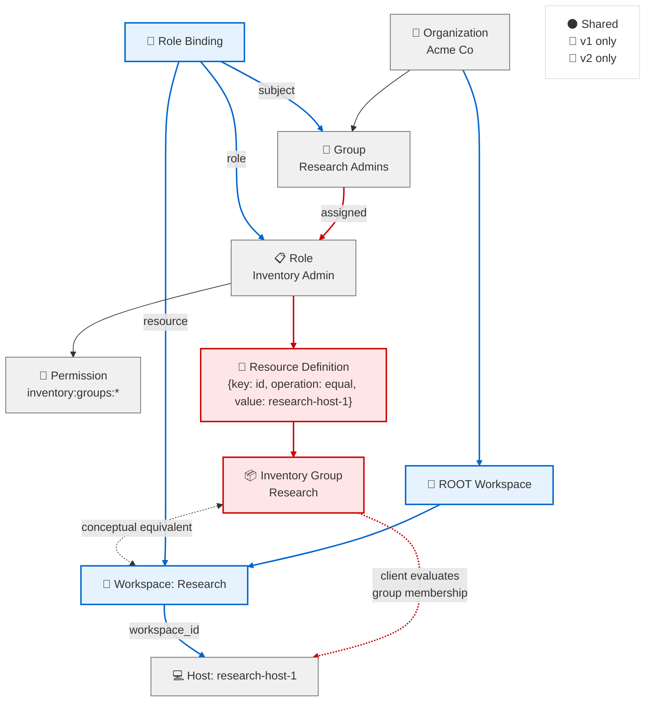
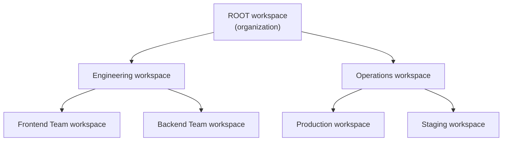
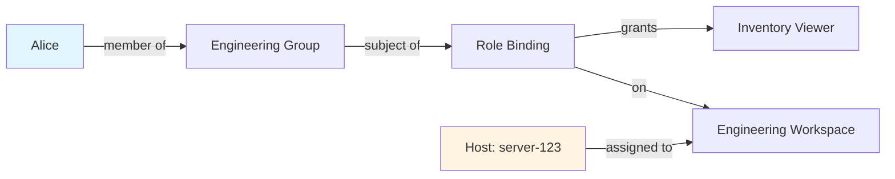

import { Aside, LinkCard } from '@astrojs/starlight/components';

If you're familiar with Red Hat Insights RBAC v1 (the legacy RBAC system), Kessel-based RBAC v2 introduces several new concepts and changes how authorization works. This document explains the key conceptual shifts to help you understand how familiar RBAC v1 patterns map to the new model.

<Aside type="note">
  This is a conceptual overview, not a migration guide. For step-by-step migration instructions, see [Migrate from RBAC v1 to RBAC v2](/docs/building-with-kessel/how-to/migrate-from-rbac-v1-to-v2/).
</Aside>

## Core Conceptual Shifts

RBAC v2 introduces four fundamental changes to how authorization works:

**1. Workspace-Based Scoping** — Permissions are no longer just organization-wide. They can be scoped to specific workspaces (organizational units), with a hierarchy that enables permission inheritance.

**2. Wildcard Permissions** — Wildcard permissions (`config_manager:*:read`) are evaluated server-side by Kessel, not by your application code.

**3. Graph-Based Authorization** — Permission checks traverse a relationship graph rather than simple permission list matching. This enables complex patterns like "users who can view a parent workspace can view child workspaces."

**4. Everything is a Resource** — Users, groups, workspaces, roles, and your application's resources (hosts, policies, etc.) are all modeled uniformly as resources with relationships. This removes the implicit dependency from Inventory to RBAC, preventing circular dependencies and enabling a consistent API across all resource types. RBAC depends on Inventory, but Inventory does not depend on RBAC.

The rest of this document explains each shift in detail.

## Visual Comparison: v1 vs v2

To understand these shifts, let's look at how authorization works for the same scenario in both models: granting the "Research Admins" group access to research hosts.



**Key differences:**

- **v1 scoping**: Resource definitions filter permissions to specific inventory groups. Each role-permission pair can have a resource definition that limits which inventory groups it applies to.
- **v2 scoping**: Role bindings grant a role to a group on a specific workspace. Resources are assigned to workspaces via `workspace_id`.
- **Shared concepts**: Organizations, groups, roles, permissions, and hosts exist in both models but are connected differently.

### Resource Definitions (v1 Only)

In RBAC v1, **resource definitions** were access control list (ACL) filters attached to permissions within a role. They allowed restricting a permission to specific resources based on attribute matching.

**Structure:**

A resource definition contained an `attributeFilter` with three fields:

```json
{
  "key": "uuid",
  "operation": "equal",
  "value": "39c8cecd-e595-46fb-8908-13365d59d5e8"
}
```

**Operations:**
- `equal` — Match a single value
- `in` — Match any value in an array

**Example with multiple resources:**
```json
{
  "key": "group.id",
  "operation": "in",
  "value": ["uuid-1", "uuid-2", "uuid-3"]
}
```

**How they worked:**

When a role included a permission, attaching a resource definition restricted that permission to only resources matching the filter.

- An empty resource definitions array `[]` meant "no additional filtering" — permission applied to all resources
- Application code had to query RBAC for both permissions and resource definitions
- Each service interpreted and applied these filters when making authorization decisions

**Inventory groups as resource definitions:**

For inventory permissions, `group.id` was used to filter access to specific inventory groups. This is how RBAC v1 implemented workspace-like scoping for host-centric resources:
- Key: `group.id`
- Operation: `in` (for multiple groups) or `equal` (for a single group)
- Value: Array of inventory group UUIDs or a single UUID

**Example:**

A role "Inventory Admin" might include:
- Permission: `inventory:groups:*`
- Resource definition: `{key: "group.id", operation: "equal", value: "research-group-uuid"}`
- Result: Admin can manage only the Research inventory group, not other groups

**In RBAC v2:**

Resource definitions don't exist. Instead, scoping is achieved through:
- **Workspace assignment** — Resources belong to a workspace via `workspace_id`
- **Role bindings** — Roles are granted to groups on specific workspaces
- **Kessel's authorization graph** — Permission checks automatically respect workspace boundaries

This eliminates the need for application code to interpret filters. Kessel handles all scoping server-side through the relationship graph.

## Permissions: Format and Transformation

### Permission Format (Transformed for Kessel)

**RBAC v1 and v2 both use the three-part format:**

```
application:resource_type:operation
```

**Examples:**
- `config_manager:profile:read`
- `patch:system:write`
- `advisor:recommendation_results:*`

**However, in RBAC v2, these are transformed when written to Kessel:**

1. **Colons become underscores**: `config_manager:profile:read` → `config_manager_profile_read`
2. **Operation names** — it's recommended to use different verbs to prevent collisions with v1 permissions:
   - `read` → `view` (recommended)
   - `write` → `edit` (recommended)
3. **Final permission name**: `config_manager_profile_view`

**What this means:**

When you check permissions with Kessel, you use the transformed name (`config_manager_profile_view`), not the RBAC v1 format. The schema handles this transformation automatically using the `@rbac.add_v1_based_permission()` extension.

<Aside type="note">
  The operation name changes (`read` → `view`, `write` → `edit`) are guidelines to help avoid collisions with v1 permissions in the authorization schema, not strict requirements. You can choose different operation names if they better fit your use case.
</Aside>

### Wildcard Permissions (Query for Specific Permission Only)

**RBAC v1:**

In the legacy system, wildcard permissions like `config_manager:*:read` were stored as strings. Your application code had to test all possible wildcard variations:

```python
# RBAC v1: Client-side wildcard logic
def has_permission(user_permissions, required_permission):
    # Must check exact match AND all wildcard variations
    for perm in user_permissions:
        if matches_wildcard(perm, required_permission):
            return True
    return False
```

To check if a user had `config_manager:profile:read`, you had to test all variations:
- `config_manager:profile:read` (exact match)
- `config_manager:profile:*` (wildcard operation)
- `config_manager:*:read` (wildcard resource type)
- `config_manager:*:*` (wildcard both)
- `*:*:*` (global wildcard)

Your code had to implement this matching logic. This led to wildcard handling being duplicated across all applications, each acting as its own Policy Decision Point (PDP). If wildcard semantics needed to change, every application required updates, and there was no guarantee of consistent behavior across the platform.

**RBAC v2:**

You only query for the specific permission you need (using the transformed v2 name). Kessel handles all wildcard matching server-side.

```python
# RBAC v2: Use Kessel client to check specific permission
# Server handles wildcard matching automatically
result = kessel_client.check(
    resource=workspace,
    permission="config_manager_profile_view",  # Transformed: read → view
    subject=user
)
```

Kessel automatically checks all applicable wildcard permissions (`config_manager_profile_all`, `config_manager_all_view`, etc.) and returns the result.

**What this means:**

- **Services query for specific permissions only** — No need to test all wildcard variations in your code
- **Consistent behavior** — All applications get the same wildcard semantics
- **Simpler code** — One check instead of multiple wildcard tests

## Workspace Hierarchy and Scoping

This is the biggest conceptual shift in RBAC v2.

### RBAC v1: Organization-Wide or Inventory Groups

**RBAC v1** had two scoping models:

**Organization-wide permissions:**
- Permissions applied to the entire organization
- Example: A user with `config_manager:profile:read` could read all profiles in the org

**Inventory group filtering (host-specific):**
- Some permissions used inventory groups (RBAC v1 inventory groups, not RBAC v2 workspaces) to filter access to hosts
- Example: `inventory:hosts:read` with group filter `["prod-servers"]`
- Application code had to query RBAC for the user's allowed groups and filter data accordingly

### RBAC v2: Workspace Hierarchy

**RBAC v2** introduces **workspaces** — organizational units arranged in a tree structure:



**Key concepts:**

**Workspace assignment:**
- Resources (hosts, policies, documents, etc.) are assigned to a workspace
- This is done by setting `workspace_id` in the resource representation

**Role bindings on workspaces:**
- Instead of granting permissions organization-wide, you can also grant permissions from roles on specific workspaces
- Example: Grant "Inventory Viewer" role to Alice on the "Engineering" workspace

**Permission inheritance:**
- Role bindings on parent workspaces grant access to child workspaces
- If Alice has "Inventory Viewer" on "Engineering", she can view resources in "Frontend Team" and "Backend Team"
- This happens automatically — no special handling needed

**What this means:**

- **Scoped access by default** — Most permissions are workspace-scoped
- **Hierarchical delegation** — Admins at higher levels automatically have access to lower levels
- **Simpler group management** — Workspaces replace complex inventory group filters

<Aside>
  In RBAC v1, you filtered hosts by inventory groups in your application code. In RBAC v2, you query Kessel for the workspaces a user can access, then filter resources by those workspace assignments.
</Aside>

<Aside type="caution" title="Explicit workspace assignment in RBAC v2">
  **RBAC v1** required complex interpretation of the returned groups list. Services had to handle special cases like global access (`"*"`), ungrouped resources (`[[]]`), and group ID matching:
  
  ```ruby
  # RBAC v1: Each service implemented this logic
  # RBAC::ANY = "*"
  (groups == Rbac::ANY) || 
  (system.groups.blank? && groups&.include?([])) || 
  system.group_ids.intersect?(groups)
  ```
  
  This interpretation logic was duplicated across services, leading to potential inconsistencies.
  
  **RBAC v2** returns only explicit workspaces where you have permissions. When you query Kessel for accessible workspaces, you get exactly the workspace IDs you can access - no special cases, no wildcards, no interpretation required.
</Aside>

## Authorization Model: Checks vs. Graph Traversal

### RBAC v1: Simple Permission Matching

**RBAC v1** used straightforward permission checking:

1. Fetch user's permissions from RBAC service
2. Check if the required permission is in the list (handling wildcards)
3. For inventory groups, additionally check if the resource's group is allowed

```python
# RBAC v1 pattern
user_permissions = rbac_client.get_user_permissions(user_id)
if required_permission in user_permissions:
    allow_access()
```

### RBAC v2: Relationship Graph Traversal

**RBAC v2** models authorization as a graph of relationships:



When you call `Check` to ask "Can Alice view this host?", Kessel:
1. Finds the host's workspace assignment
2. Walks up the workspace hierarchy
3. Checks if Alice (or her groups) has a role binding at any level
4. Verifies the role includes the requested permission
5. Returns allowed/denied

**What this means:**

- **No permission lists in responses** — You don't fetch a user's permissions; you ask "can they do this specific thing?"
- **Context-aware** — The same user might have different permissions on different workspaces
- **Complex patterns supported** — Inheritance, group membership, and role composition happen automatically

## Role Bindings: Where Permissions Are Granted

### RBAC v1: Roles Assigned to Groups

**RBAC v1:**

Roles were assigned to groups at the organization level:
- Create a role with permissions
- Assign the role to a group
- The user gets those permissions organization-wide (unless filtered by inventory groups)

### RBAC v2: Role Bindings on Resources

**RBAC v2:**

Roles are bound to subjects (principals/groups) **on specific resources** (workspaces or tenants):

**Role binding structure:**
- **Role** — The role being granted (e.g., "Inventory Viewer")
- **Subject** — Who gets the role (a group; binding to individual principals is a future capability)
- **Resource** — Where the role applies (a workspace or tenant)

**Example:**

"Grant the Inventory Viewer role to the Engineering Group on the Engineering workspace"

```json
{
  "role": "inventory-viewer-role-uuid",
  "subject": {
    "type": "group",
    "id": "engineering-group-uuid"
  },
  "resource": {
    "type": "workspace",
    "id": "engineering-workspace-uuid"
  }
}
```

**What this means:**

- **Scoped grants** — Roles apply to specific workspaces, not the entire organization
- **Multiple bindings** — The same role can be granted to different groups on different workspaces
- **Workspace inheritance** — A binding on a parent workspace grants access to child workspaces

## What Stays the Same

Not everything changed. These concepts are familiar from RBAC v1:

**Groups:**
- Groups are collections of principals (users or service accounts)
- Principals can belong to multiple groups
- In v1, roles were assigned to groups only; in v2, role bindings target groups (binding to individual principals is a future capability)

**Roles:**
- Roles are still named collections of permissions
- Custom roles can be created by organization admins
- Seeded roles are provided by the system

**Permissions:**
- Still use the `application:resource_type:operation` format
- Wildcards are supported (but evaluated differently)

**Permission checks:**
- You still check "does this user have this permission?" before allowing an action
- The mechanics changed (graph traversal vs. list matching) but the concept is the same

## Common Migration Patterns

When migrating from RBAC v1 to v2, most use cases fall into these patterns:

**Default workspace pattern:**
- Resources that aren't explicitly workspace-aware yet
- Assign all resources to the organization's default workspace
- Role bindings on default workspace grant access organization-wide (like RBAC v1 behavior)

**Root workspace pattern:**
- Organization-wide settings or permissions
- Check permissions on the ROOT workspace
- Maintains organization-level access control

**Workspace-level list pattern:**
- Resources that are workspace-aware (especially host-centric assets)
- Query Kessel for workspaces the user can access
- Filter application data by those workspace IDs
- Replaces inventory group filtering

**Organization-level pattern:**
- Permissions that truly apply organization-wide and should never be workspace-scoped
- Bound to the tenant resource, not workspaces

See the [migration guide](/docs/building-with-kessel/how-to/migrate-from-rbac-v1-to-v2/) for detailed implementation examples.

## Next Steps

<LinkCard
  title="Migrate from RBAC v1 to RBAC v2"
  description="Step-by-step guide for migrating from legacy RBAC to Kessel-based RBAC."
  href="/docs/building-with-kessel/how-to/migrate-from-rbac-v1-to-v2/"
/>

<LinkCard
  title="Role-based access control"
  description="Understand the RBAC v2 model in depth: roles, permissions, role bindings, and groups."
  href="/docs/building-with-kessel/concepts/rbac/"
/>

<LinkCard
  title="Identity and multi-tenancy"
  description="Learn about workspaces, workspace hierarchy, and tenant isolation."
  href="/docs/building-with-kessel/concepts/tenancy/"
/>

<LinkCard
  title="Relationships and permissions"
  description="Understand the authorization graph and how permission checks work."
  href="/docs/building-with-kessel/concepts/relationships-permissions/"
/>
