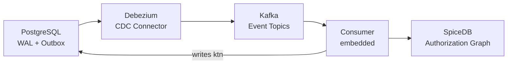

import { Aside, LinkCard } from '@astrojs/starlight/components';

Kessel is a distributed system with two distinct data stores: **PostgreSQL** holds resource inventory data, and **SpiceDB** holds the authorization graph (relationship tuples). When you report a resource, the data lands in PostgreSQL first and then flows asynchronously to SpiceDB through a Change Data Capture (CDC) pipeline. This means Kessel is **eventually consistent** -- there is always a window of time between a write and that write becoming visible to permission checks.

This is not a bug or a limitation to work around. It is a deliberate architectural choice. Decoupling the write path from the authorization path allows Kessel to accept resource reports at high throughput without blocking on the authorization backend. Most authorization checks tolerate small amounts of staleness, and the replication window is typically measured in hundreds of milliseconds.

Understanding this consistency model is essential for building integrations that behave correctly. This document explains how data flows through the system, what consistency guarantees are available, and how to choose the right strategy for your use case.

## The CDC pipeline

When you call `ReportResource`, the Inventory API writes your resource data and an outbox event within a single PostgreSQL transaction. This transactional outbox pattern guarantees that the event is published if and only if the data is committed -- there is no risk of the database and the event stream diverging.

From there, the event flows through a multi-stage pipeline:

1. **PostgreSQL** commits the transaction and writes outbox events to the WAL.
2. **Debezium** captures WAL changes and routes them to Kafka topics.
3. **Kafka** durably stores the events for consumption.
4. **The Consumer** reads tuple events, calculates the required relationship changes, and calls the Relations API to update SpiceDB.
5. **SpiceDB** applies the tuples and returns a **ZedToken** (consistency token).
6. The Consumer writes the ZedToken back to the resource's `ktn` column in PostgreSQL.

Each stage introduces a small amount of latency. Under normal conditions the full pipeline completes in 100-500ms, but this can vary with load, network conditions, and the number of tuples per resource.

<Aside>
  The pipeline emits **two** outbox events per resource operation: one for the resource lifecycle (`kessel.resources`) and one for relationship tuples (`kessel.tuples`). Only the tuple events flow to SpiceDB. Resource events are available for downstream consumers on separate Kafka topics.
</Aside>

## Consistency modes

When you perform a permission check (`Check`, `CheckForUpdate`, `CheckBulk`), you choose how fresh the authorization data needs to be. Kessel supports three consistency modes:

### `minimize_latency`

This is the default. SpiceDB serves the check from the nearest replica without waiting for any particular replication state. It provides the lowest latency but may return results based on slightly stale data.

Use this for dashboards, list pages, and any read-heavy path where a brief replication lag is acceptable.

### `at_least_as_fresh`

The caller provides a consistency token obtained from a previous operation. SpiceDB guarantees that the check reflects at least the state represented by that token. If the replica has not yet caught up, SpiceDB waits until it does.

Use this when you need causal consistency between two operations -- for example, ensuring a check reflects a specific tuple write you performed earlier.

### `at_least_as_acknowledged`

The Inventory API looks up the ZedToken stored in the resource's `ktn` column in PostgreSQL. This token represents the last state that the Consumer successfully replicated to SpiceDB. The check is guaranteed to reflect at least this committed state.

Use this for critical authorization decisions where you need confidence that the check reflects the resource's current state in the database, without requiring the caller to manage tokens.

### Comparing the modes

| Mode | Token source | Freshness guarantee | Latency | Best for |
|------|-------------|---------------------|---------|----------|
| `minimize_latency` | None | May read stale data | Lowest | Dashboards, list views, read-heavy paths |
| `at_least_as_fresh` | Caller-provided | At least the caller's known state | Medium | Causal consistency between operations |
| `at_least_as_acknowledged` | Database lookup (`ktn`) | At least the last committed state | Higher | Critical access decisions |

<Aside type="tip">
  When in doubt, start with `minimize_latency`. Upgrade to a stronger mode only for paths where stale authorization data would cause a visible correctness problem.
</Aside>

## How consistency tokens work

SpiceDB uses **ZedTokens** as consistency tokens. A ZedToken is an opaque value that represents a specific point in SpiceDB's transaction log. You can think of it as a logical timestamp for the authorization graph.

The token lifecycle in Kessel works as follows:

1. The Consumer writes relationship tuples to SpiceDB.
2. SpiceDB commits the tuples and returns a ZedToken.
3. The Consumer stores this token in the `ktn` (Kessel Token Notation) column of the `resource` table in PostgreSQL.
4. When a `Check` request uses `at_least_as_acknowledged`, the Inventory API reads the `ktn` value for the target resource and passes it to SpiceDB.
5. SpiceDB ensures the check is evaluated against a state that is at least as recent as the token.

For `at_least_as_fresh`, the token comes from the caller instead of the database. This is useful when your application holds a token from a previous write and wants to ensure subsequent reads are causally consistent with that write.

## Write visibility and the IMMEDIATE mode

By default, `ReportResource` returns as soon as the PostgreSQL transaction commits. The caller does not wait for the CDC pipeline to replicate data to SpiceDB. This means a permission check issued immediately after a report may not yet reflect the change.

For scenarios where you need the report and the authorization state to be synchronized before returning to the caller, Kessel supports a **write visibility** option called `IMMEDIATE`.

### How IMMEDIATE works

1. The Inventory API subscribes to a PostgreSQL `LISTEN` channel (`consumer_notifications`) before committing the transaction.
2. The transaction commits and the outbox event flows through the CDC pipeline.
3. The Consumer processes the event, updates SpiceDB, and sends a PostgreSQL `NOTIFY` on the same channel.
4. The Inventory API receives the notification and unblocks the response to the caller.

This guarantees that by the time the caller receives a successful response, the authorization graph in SpiceDB reflects the reported resource.

### Circuit breaker protection

IMMEDIATE mode depends on the Consumer being available and processing events in a timely manner. To prevent requests from hanging indefinitely if the Consumer is down or lagging, a circuit breaker protects this path:

- The breaker trips after **3 consecutive failures** (timeouts or errors).
- Once tripped, IMMEDIATE requests fail fast rather than waiting.
- The breaker resets after **60 seconds** and allows requests through again.

### Performance impact

IMMEDIATE mode adds the full CDC pipeline latency to the request -- typically **100-500ms** on top of the base write latency. The LISTEN/NOTIFY mechanism has a **10-second timeout**; if the consumer doesn't process the event within that window, the circuit breaker trips and the request fails fast. Use IMMEDIATE mode only when your application flow genuinely requires the authorization state to be updated before proceeding.

<Aside type="caution">
  Do not add artificial `sleep()` delays in your code to wait for replication. Either use IMMEDIATE mode for guaranteed write visibility, or design your UX to handle eventual consistency gracefully (e.g., show a "processing" indicator).
</Aside>

## Choosing a consistency strategy

The right consistency mode depends on what your application is doing at the moment of the check:

**User is browsing a dashboard or list page.** Use `minimize_latency`. A stale result for a few hundred milliseconds is invisible to the user, and the lower latency makes the page feel responsive.

**User just performed a write and is viewing the result.** Use `at_least_as_acknowledged` or set write visibility to IMMEDIATE. The user expects to see the effect of their action. Showing stale data here creates confusion ("I just shared this document, why can't my collaborator see it?").

**Your service is chaining operations.** Use `at_least_as_fresh` with a token from the prior operation. This gives you causal ordering without paying for a database lookup on every check.

**Your service is making a security-critical decision.** Use `at_least_as_acknowledged`. The small additional latency is worth the guarantee that the check reflects the committed state.

### UX patterns for eventual consistency

If you choose not to use IMMEDIATE mode, consider these patterns:

- **Optimistic UI** -- assume the operation will succeed and update the UI immediately. Reconcile later if the backend state differs.
- **Processing indicator** -- show a brief "updating permissions..." state after a write, then refresh.
- **Client-side caching** -- after a successful write, cache the expected authorization state on the client and use it until the next full refresh.

## Limitations

There are several constraints to be aware of when working with Kessel's consistency model:

- **Bulk operations do not support `at_least_as_acknowledged`.** `CheckBulk` spans multiple resources, and looking up a consistency token per resource would be prohibitively expensive. Bulk checks use `minimize_latency` or `at_least_as_fresh`.

- **Multi-resource scenarios require care.** If your operation touches multiple resources, each resource has its own `ktn` token. There is no single token that covers all of them. For cross-resource consistency, use `at_least_as_fresh` with a token that covers the latest write across all resources involved.

- **IMMEDIATE mode requires the consumer to be enabled.** The PostgreSQL LISTEN/NOTIFY mechanism depends on the embedded Consumer running and processing events. If the Consumer is disabled or unreachable, IMMEDIATE mode will trigger the circuit breaker and fail.

- **Replication lag is not bounded.** Under extreme load or component failure, the CDC pipeline can fall behind. Monitor consumer lag and Debezium connector health to detect and respond to these situations. See the monitoring guide for recommended metrics.

## Next steps

<LinkCard
  title="Architecture"
  description="Understand how Kessel's components are connected and how data flows between them."
  href="/docs/running-kessel/architecture/"
/>

<LinkCard
  title="Integration patterns"
  description="Practical recipes for resource reporting, permission checks, and consistency strategies."
  href="/docs/building-with-kessel/how-to/integration-patterns/"
/>

<LinkCard
  title="Monitoring data replication"
  description="Track CDC pipeline health, consumer lag, and replication metrics."
  href="/docs/running-kessel/monitoring-kessel/monitoring-data-replication-inventory-api/"
/>
