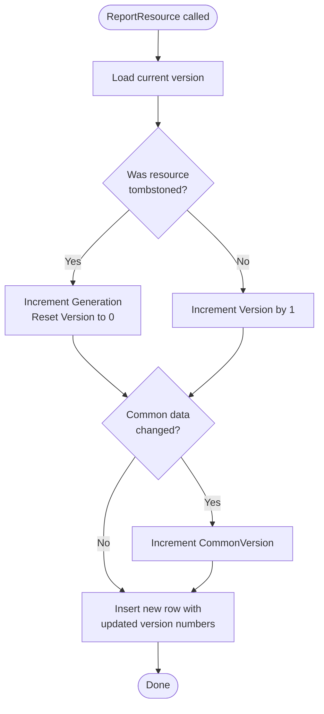
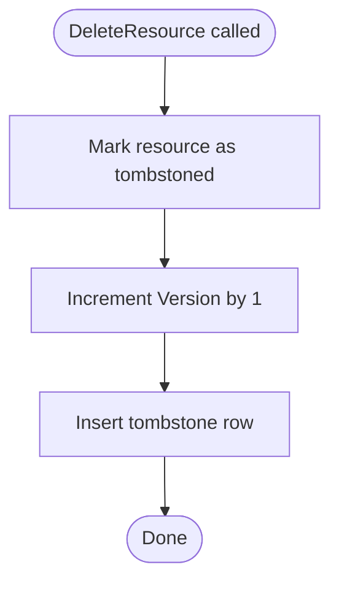
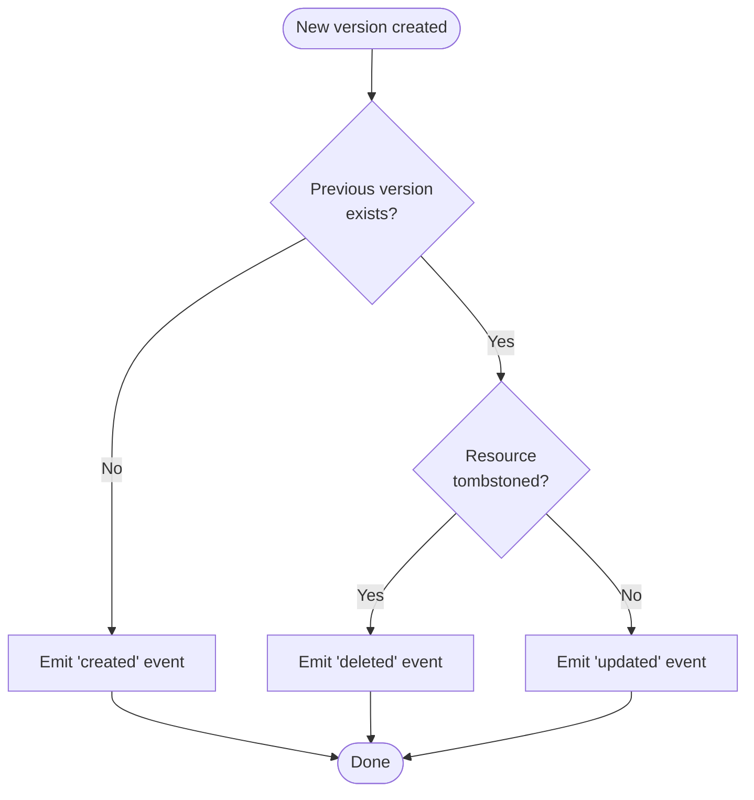

import { Aside, LinkCard } from '@astrojs/starlight/components';

Kessel maintains a complete **version history** of every resource representation. Each time a service reports a resource, Kessel creates a new immutable version rather than overwriting the previous state. This append-only design provides a full audit trail of how resources evolve and enables change detection for event publishing.

Understanding the versioning system is essential for interpreting resource state, debugging integration issues, and understanding how Kessel detects changes.

## Why Versioning Matters

Versioning serves several purposes in Kessel's architecture:

**Audit Trail** — Every change to a resource is preserved as an immutable snapshot, providing a complete history for compliance, debugging, or forensic analysis.

**Change Detection** — Kessel compares the current version with the previous version to determine what changed and emit appropriate events to Kafka.

**Lifecycle Tracking** — Generation numbers distinguish resource resurrections (delete → recreate) from continuous updates.

**No Overwrites** — Representations are never modified in place. Each `ReportResource` call creates a new version, ensuring past states remain queryable.

## The Four-Level Versioning Hierarchy

Kessel uses **four distinct version fields** to track different aspects of resource evolution:

### 1. Version (Reporter Representation)

**Scope:** Reporter-specific representation  
**Increments:** Every `ReportResource` call  
**Purpose:** Tracks individual data snapshots for a specific reporter's view of the resource

Each time a reporter calls `ReportResource`, Kessel increments the reporter representation `Version` by 1, even if the payload data is identical. This monotonically increasing counter provides a total ordering of all reports from that reporter.

**Example:**
- Reporter "acs" reports cluster-789: `Version = 0`
- Reporter "acs" reports cluster-789 again: `Version = 1`
- Reporter "acs" reports cluster-789 again: `Version = 2`

### 2. Generation

**Scope:** Reporter-specific resource lifecycle  
**Increments:** When a tombstoned resource is resurrected  
**Purpose:** Distinguishes delete/recreate cycles from continuous updates

When a resource is deleted (tombstoned) and then re-reported, the `Generation` number increments and the representation `Version` resets to 0. This allows Kessel to track how many times a resource has been deleted and recreated.

**Example lifecycle:**
- Create: `Generation = 0, Version = 0`
- Update: `Generation = 0, Version = 1`
- Delete: `Generation = 0, Version = 2` (tombstone, version increments)
- Recreate: `Generation = 1, Version = 0` (new lifecycle, version resets)

**Use case:** Detect when a cluster was deleted and a new cluster with the same name was created later, preventing misattribution of historical data.

### 3. CommonVersion

**Scope:** Common representation (shared across all reporters)  
**Increments:** When common representation data changes  
**Purpose:** Tracks versions of shared resource attributes

The `CommonVersion` increments only when the **common representation** payload changes. If multiple reporters report the same resource type and only reporter-specific data changes, `CommonVersion` remains stable.

**Example:**
- Reporter "acs" sets workspace_id="ws-1": `CommonVersion = 1`
- Reporter "acs" updates reporter data (workspace unchanged): `CommonVersion = 1` (no change)
- Reporter "cost-mgmt" updates workspace_id="ws-2": `CommonVersion = 2`

This allows consumers to detect when **shared metadata** changes vs when only reporter-specific details change.

### 4. ReporterVersion

**Scope:** Reporter-supplied semantic version  
**Increments:** Manually set by the reporter (optional)  
**Purpose:** Opaque metadata for reporter's own versioning scheme

The `ReporterVersion` is a **string field** supplied by the reporter in `RepresentationMetadata.reporter_version`. Kessel treats it as opaque metadata and does not interpret or validate it.

**Use case:** A reporter tracks its own data schema evolution (e.g., `"v2.1.0"`) and includes it in the payload for downstream consumers to detect schema changes.

## Version Increment Logic

### ReportResource Flow

### DeleteResource Flow

<Aside type="note">
  After a resource is deleted, the next `ReportResource` call will increment the Generation and reset Version to 0, starting a new lifecycle.
</Aside>

## Change Detection for Events

Kessel compares the current version with the previous version to determine what changed and emit appropriate events.

<Aside type="note">
  Change detection compares **common representation** versions to detect changes in shared resource metadata. Reporter-specific representation changes are tracked separately for each reporter.
</Aside>

Without immutable version history, Kessel could not reliably distinguish between actual data changes and redundant reports of the same state.

## Next Steps

<LinkCard
  title="Events and change notifications"
  description="Learn how version history enables change detection for Kafka event publishing."
  href="/docs/building-with-kessel/concepts/events/"
/>

<LinkCard
  title="Consistency model"
  description="Understand how version increments relate to consistency guarantees and replication."
  href="/docs/building-with-kessel/concepts/consistency/"
/>

<LinkCard
  title="Resources and representations"
  description="See how representations are structured and how versioning applies to them."
  href="/docs/building-with-kessel/concepts/resources-representations/"
/>
