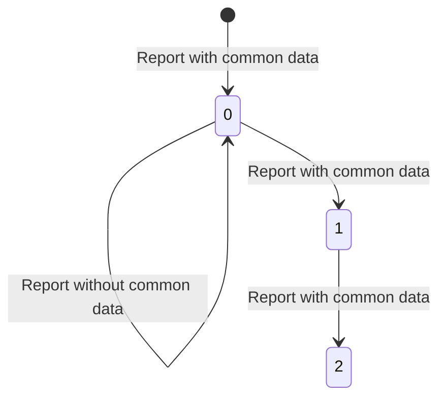
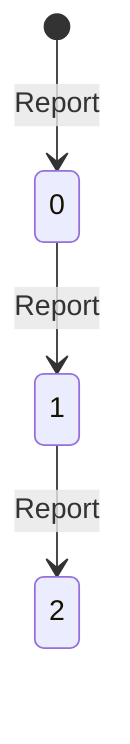
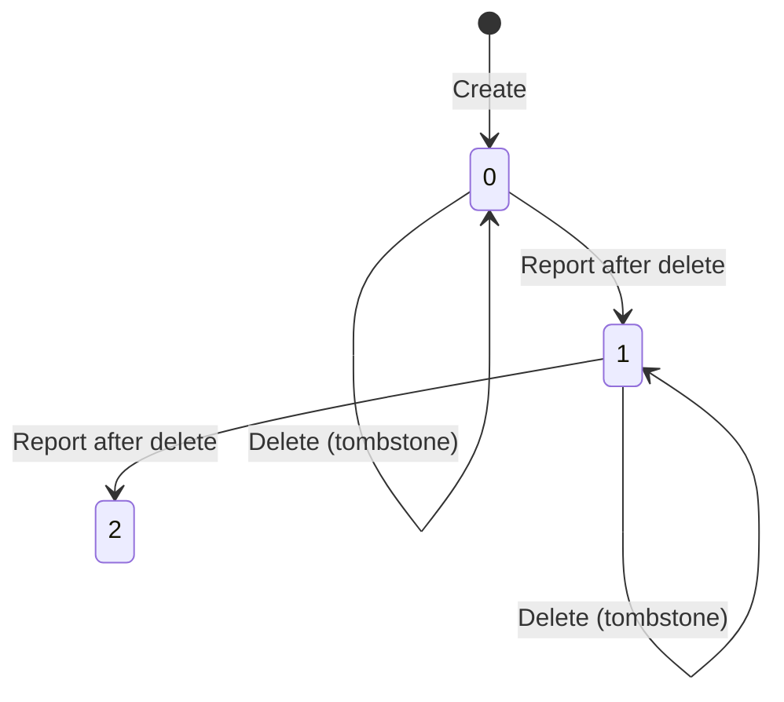
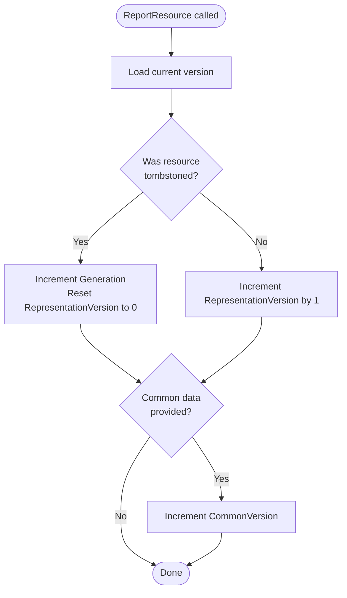
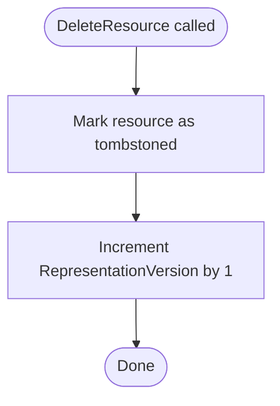
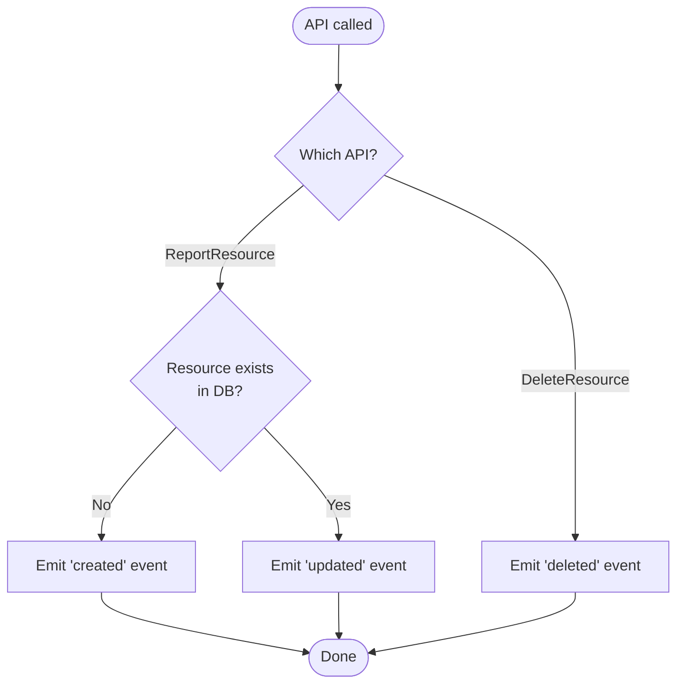

import { Aside, LinkCard } from '@astrojs/starlight/components';

Kessel maintains a complete **version history** of every resource representation. Each time a service reports a resource, Kessel creates a new immutable version rather than overwriting the previous state. Because Kessel never overwrites data, you get a full audit trail of how resources evolve and reliable change detection for event publishing.

Understanding the versioning system is essential for interpreting resource state, debugging integration issues, and understanding how Kessel detects changes.

## Why Version History?

Kessel's version tracking helps with:

**Audit Trail** — Every change to a resource is preserved as an immutable snapshot, providing a complete history for compliance, debugging, or forensic analysis.

**Change Detection** — Kessel compares the current version with the previous version to determine what changed and emit appropriate events to Kafka.

**Lifecycle Tracking** — Generation numbers distinguish resource resurrections (delete → recreate) from continuous updates.

**No Overwrites** — Representations are never modified in place. Each `ReportResource` call creates a new version, ensuring past states remain queryable.

## Four Types of Version Numbers

Kessel tracks resource evolution using **four distinct version fields**:

### 1. CommonVersion

**Scope:** Shared across all reporters  
**Increments:** When common representation data is provided  
**Purpose:** Tracks versions of shared resource attributes

The `CommonVersion` increments by 1 each time a reporter includes **common representation** data in a report (starting from 0). When no common data is provided, `CommonVersion` remains unchanged.

**CommonVersion progression:**

This ensures `CommonVersion` always increments monotonically across the resource's lifetime, regardless of which reporter provides the common data or whether some reports omit it.

### 2. RepresentationVersion

**Scope:** Per-reporter representation  
**Increments:** Every `ReportResource` call  
**Purpose:** Tracks individual data snapshots for a specific reporter's view of the resource

Each time a reporter calls `ReportResource`, Kessel increments the `RepresentationVersion` by 1, even if the payload data is identical. This monotonically increasing counter provides a total ordering of all reports from that reporter.

**RepresentationVersion progression:**

### 3. Generation

**Scope:** Per-reporter lifecycle  
**Increments:** When a tombstoned resource is resurrected  
**Purpose:** Distinguishes delete/recreate cycles from continuous updates

When a resource is deleted (tombstoned) and then re-reported, the `Generation` number increments and the `RepresentationVersion` resets to 0. This allows Kessel to track how many times a resource has been deleted and recreated.

**Generation progression:**

**Use case:** Detect when a cluster was deleted and a new cluster with the same name was created later, preventing misattribution of historical data.

### 4. ReporterVersion

**Scope:** Reporter-supplied metadata  
**Increments:** Manually set by the reporter (optional)  
**Purpose:** Opaque metadata for reporter's own versioning scheme

The `ReporterVersion` is a **string field** supplied by the reporter in `RepresentationMetadata.reporter_version`. Kessel stores this field as-is without interpreting or validating it.

**Use case:** A reporter tracks its own data schema evolution (e.g., `"v2.1.0"`) and includes it in the payload for downstream consumers to detect schema changes.

## Version Increment Logic

### ReportResource Flow

### DeleteResource Flow

<Aside type="note">
  After a resource is deleted, the next `ReportResource` call will increment the Generation and reset RepresentationVersion to 0, starting a new lifecycle.
</Aside>

## Event Type Determination

Kessel determines which event type to emit based on the API called and whether the resource already exists in the database.

## Next Steps

<LinkCard
  title="Events and change notifications"
  description="Learn how version history enables change detection for Kafka event publishing."
  href="/docs/building-with-kessel/concepts/events/"
/>

<LinkCard
  title="Consistency model"
  description="Understand how version increments relate to consistency guarantees and replication."
  href="/docs/building-with-kessel/concepts/consistency/"
/>

<LinkCard
  title="Resources and representations"
  description="See how representations are structured and how versioning applies to them."
  href="/docs/building-with-kessel/concepts/resources-representations/"
/>
