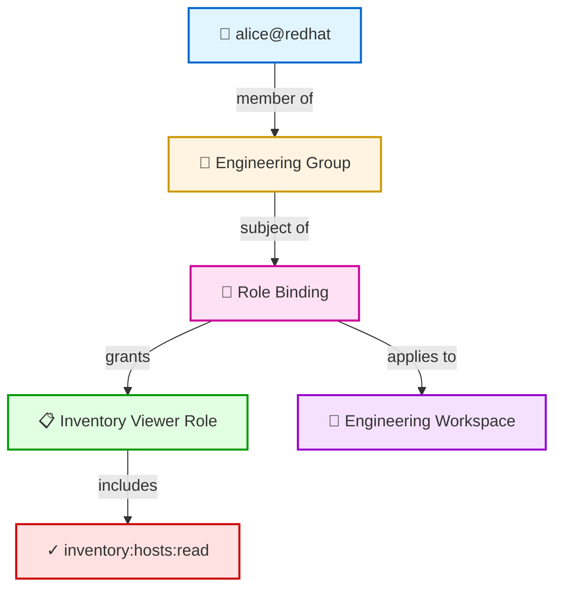

import { Aside, LinkCard } from '@astrojs/starlight/components';

Kessel's authorization system is built on **role-based access control (RBAC)** — users get permissions through roles, and roles are assigned to users via role bindings. This document explains the core RBAC concepts: permissions, roles, role bindings, groups, and how authorization decisions are evaluated.

## The RBAC Model

At its core, a role binding answers the question: **"Who has what permissions on which resource?"**

```
Subject (who) + Role (what permissions) + Resource (where) = Role Binding
```

- **Subject** — A group or individual principal (user/service account)
- **Role** — A collection of permissions
- **Resource** — The target object (workspace, tenant, or platform)
- **Role Binding** — The link that grants a role's permissions to a subject on a specific resource

## Permissions

A **permission** is an action that can be performed on a specific type of resource. Permissions use the format:

```
application:resource_type:operation
```

**Examples:**
- `inventory:hosts:read` — Read hosts in the inventory
- `advisor:recommendation_results:write` — Write recommendation results
- `rbac:workspaces:role_binding_grant` — Grant role bindings on workspaces

**Wildcards** are supported:
- `inventory:*:*` — All inventory permissions
- `inventory:hosts:*` — All operations on inventory hosts
- `inventory:*:read` — Read all inventory resource types

Wildcards make it easier to grant broad permissions without listing every individual permission.

<Aside type="caution">
  The application portion cannot be wildcarded — permissions must specify which application they belong to.
</Aside>

### Permission Scope

Permissions fall into two categories based on their scope:

**Data-level permissions** — Apply to resources within workspaces, respecting the workspace hierarchy:
- `inventory:hosts:read`
- `advisor:recommendation_results:*`

These permissions are evaluated using the resource's workspace assignment. If you have `inventory:hosts:read` on the "Engineering" workspace, you can read hosts assigned to Engineering or any of its child workspaces.

**Org-level permissions** — Apply organization-wide, regardless of workspace:
- `notifications:notifications:read`
- `rbac:workspaces:create`

These permissions are bound to the tenant or platform resource rather than workspaces.

## Roles

A **role** is a named collection of permissions. Instead of granting individual permissions to users, you grant roles that bundle related permissions together.

**Example role:**
```json
{
  "name": "Inventory Viewer",
  "permissions": [
    "inventory:hosts:read",
    "inventory:groups:read",
    "inventory:staleness_counts:read"
  ]
}
```

### Role Types

Kessel has three types of roles:

| Type | Created By | Modifiable | Use Case |
|------|-----------|------------|----------|
| **CUSTOM** | Organization admins | Yes | Org-specific roles tailored to business needs |
| **SEEDED** | System (pre-defined) | No | Common roles like "Org Admin", "Workspace Admin" |
| **PLATFORM** | System (internal) | No | Aggregate roles used for default bindings |

**Custom roles** are created by organization administrators to match their specific access control needs. They can be updated and deleted.

**Seeded roles** are provided by the system with predefined permissions. They cannot be modified but can be assigned to users. Examples include "Organization Admin" and "Workspace Viewer".

**Platform roles** are internal roles that aggregate multiple seeded roles. They are used for default role bindings and are not directly visible in the API.

### How Roles Work

**Custom roles** store each permission as a relationship in the authorization graph. When a user receives a role binding to that role, they inherit all the role's permissions.

**Seeded roles** have permissions defined directly in the authorization schema rather than stored individually. This makes system-provided roles like "Organization Admin" and "Workspace Viewer" more efficient since they're used by many users.

## Role Bindings

A **role binding** connects a role to a subject (group or principal) on a specific resource (workspace or tenant). This is the mechanism that actually grants permissions.

**Role binding structure:**
- `role` — The role being granted (UUID reference)
- `subject` — The group or principal receiving the role
- `resource` — The workspace or tenant where the role applies
- `resource_type` — Either `"workspace"` or `"tenant"`
- `resource_id` — The UUID of the workspace or tenant

**Example:**
```json
{
  "role": "inventory-viewer-role-uuid",
  "subject": {
    "id": "engineering-group-uuid",
    "type": "group"
  },
  "resource": {
    "id": "engineering-workspace-uuid",
    "type": "workspace"
  }
}
```

This grants the "Inventory Viewer" role to the "Engineering" group on the "Engineering" workspace.

### Subject Types

Role bindings can target two types of subjects:

**Groups** (recommended) — Role bindings typically target groups rather than individual users. This makes it easier to manage access for teams:
- Add/remove users from the group to grant/revoke access
- One role binding serves all group members
- Easier to audit and maintain

**Principals** (direct user bindings) — Role bindings can also target individual users or service accounts directly, though this is less common:
- Use for exceptional cases where a specific user needs unique access
- Harder to audit and maintain at scale

### How Role Bindings Create Relationships

A role binding creates three types of relationships in the authorization graph:

1. **Binding → Role**: Links the binding to the role it grants
2. **Resource → Binding**: Links the workspace or tenant to the binding
3. **Binding → Subject**: Links the binding to the users or groups who receive it

These relationships form a graph that Kessel traverses to evaluate permission checks.

### Visualizing the Relationship Graph

Here's how the components connect when evaluating a permission check:



When a permission check asks "Can Alice read hosts in Engineering?", Kessel:
1. Finds Alice's group memberships → Engineering Group
2. Finds role bindings where Engineering Group is the subject → Role Binding
3. Checks if the binding's role grants `inventory:hosts:read` → Yes
4. Confirms the binding applies to the Engineering workspace → Yes
5. Returns: **Allowed**

## Groups

A **group** is a collection of principals. Groups make it easier to manage access for teams or organizational units.

**Group membership:**
- A principal can belong to multiple groups
- A group can contain multiple principals
- Membership is many-to-many

**Special groups:**
- **Platform default group** — All users in the organization automatically belong to this group
- **Admin default group** — Organization admins automatically belong to this group

When a role binding targets a group, all members of that group receive the role's permissions. If a user is added to the group later, they automatically gain access. If they're removed, access is revoked.

The authorization graph tracks group memberships as relationships between groups and principals. When checking permissions, the system follows these membership relationships to determine if a user is a subject of a group-targeted role binding.

## Permission Evaluation

When a client calls `Check` to verify if a user can perform an action on a resource, here's how Kessel evaluates the request:

**Step 1: Find the resource's workspace**

If the resource is an inventory host, Kessel finds which workspace it belongs to by looking up its workspace assignment.

**Step 2: Walk up the workspace hierarchy**

Starting from the resource's workspace, the authorization system checks:
1. Are there any role bindings on this workspace?
2. For each binding, is the user a subject (directly or via group membership)?
3. Does the binding's role grant the requested permission?

If no match is found, the system moves to the parent workspace and repeats. This continues up to the ROOT workspace.

**Step 3: Check tenant/platform bindings**

If the permission is org-level (not workspace-scoped), the system checks role bindings on the tenant or platform resource instead.

**Result:**

Permission is granted if **both** conditions are true:
- The user is a subject of a role binding (directly or via group)
- The binding's role includes the requested permission

<Aside type="tip">
  Kessel's authorization engine is highly optimized for graph traversals. Typical permission checks complete in 10-50ms.
</Aside>

## Permission Inheritance

Role bindings on parent workspaces automatically grant permissions on child workspaces. This is a powerful feature of the hierarchy:

**Example:**

If Alice has the "Workspace Admin" role on the "Engineering" workspace, she automatically has those permissions on:
- All child workspaces ("Frontend Team", "Backend Team")
- All resources assigned to those workspaces

**Why this matters:**

You can grant broad access at a high level (ROOT workspace) or narrow access at lower levels (specific team workspaces). Users higher in the hierarchy have more permissions.

**Combining direct and inherited bindings:**

A user can have multiple role bindings on different workspaces in the hierarchy. The authorization system evaluates all of them and grants access if **any** binding provides the required permission.

## Consistency and Replication

Role bindings are stored in two places:

1. **RBAC service database** — The source of truth for role binding metadata
2. **Authorization graph** — The authorization engine that evaluates permission checks

When you create or modify a role binding via the RBAC API, the change is replicated to the authorization backend using an **outbox pattern**:
1. The RBAC service writes the binding to its database and publishes an outbox event
2. The event stream captures the event and routes it to Kessel Relations
3. Relations writes the corresponding tuples to the authorization graph
4. Permission checks reflect the new binding once the CDC pipeline completes

This process typically completes in 100-500ms. See the [Consistency Model](../consistency) documentation for details on consistency guarantees.

## Next Steps

<LinkCard
  title="Identity and multi-tenancy"
  description="Learn about workspaces, principals, and tenant isolation."
  href="/docs/building-with-kessel/concepts/tenancy/"
/>

<LinkCard
  title="Manage access with RBAC"
  description="Step-by-step guide to creating roles, groups, and role bindings."
  href="/docs/building-with-kessel/how-to/rbac/"
/>