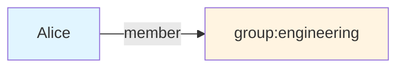
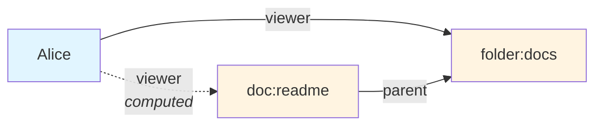
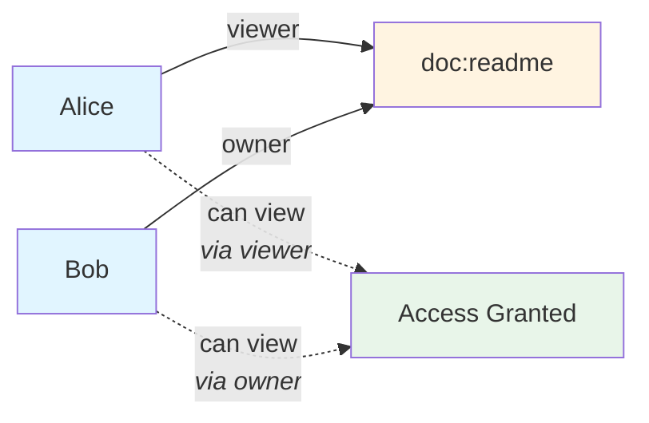
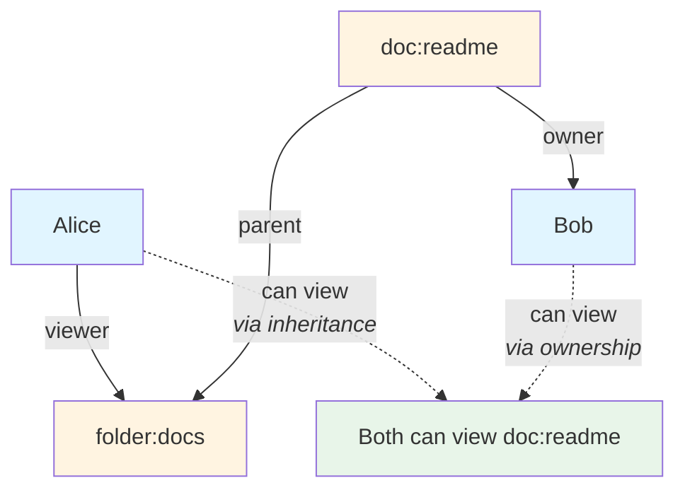

import { Aside, LinkCard } from '@astrojs/starlight/components';

Kessel's authorization system is built on a graph of **relationships** between resources. When you create a role binding, add a user to a group, or assign a resource to a workspace, you're creating relationships that Kessel uses to evaluate permissions. This document explains the core concepts behind relationships: what they are, how they're defined, and how Kessel uses them to answer authorization questions.

Understanding relationships helps you reason about how permissions work in Kessel and how your resource reports and configuration affect access control.

## Core Concepts

### Resources and Subjects

All entities in Kessel—users, groups, workspaces, hosts, roles—are modeled as **resources**. A resource is any addressable object with a type and an identifier.

**Examples:**
- `user:alice` — A user resource
- `group:engineering` — A group resource  
- `workspace:eng-prod` — A workspace resource
- `doc:readme` — A document resource

When describing a relationship, we use two relative terms:

- **Object** — The resource being accessed, or the container (e.g., the group, the document, the workspace)
- **Subject** — The entity that has the relation or is performing the action (e.g., the user, another group)

**Example:** "Alice is a member of the Engineering group"

- Object: `group:engineering` (the group being accessed)
- Relation: `member` (the type of connection)
- Subject: `user:alice` (the person who is a member)

You can read this as: "The Engineering group has Alice as a member" or "Alice has the member relation to the Engineering group."

### Relations

A **relation** is a named string that defines the *type* of connection between an object and a subject.

**Common relations:**
- `member` — Membership in a group
- `viewer` — Permission to view a resource
- `owner` — Ownership of a resource
- `parent` — Hierarchical parent-child relationship
- `workspace` — Resource assignment to a workspace

Relations are **directional**. Reversing the object and subject produces a different relation. Convention is to state the object first, then the subject: "group:engineering has member user:alice."

### Relationships

A **relationship** is the realization of a relation between an object and a subject. It's a connection in the authorization graph.

**Example relationships:**
- Alice is a member of `group:engineering`
- Alice can view `doc:readme`
- `workspace:prod` has parent `workspace:root`

Relationships are what Kessel evaluates when answering authorization questions like "Can Alice view this document?" or "What workspaces can Bob access?"

### Subject Sets

Instead of connecting to a specific subject, a relationship can point to a **subject set**—the set of all resources that share a particular relation on another object.

**Example:**
- All members of `group:engineering` can view `doc:readme`

This is how group-based permissions work: instead of creating individual relationships for each user, you create one relationship to a subject set (all members of the Engineering group). As group membership changes, the effective relationships update automatically.

A single relationship to a subject set can represent **zero-to-many** actual relationships depending on how many subjects are in the set.

<Aside>
  Subject sets are the mechanism behind workspace hierarchy permission inheritance. When you grant permissions on a parent workspace, you're granting them to the subject set "all users with access to any child workspace."
</Aside>

## How Relationships Are Defined

Here's the critical distinction: **not all relationships are stored directly**. Some relationships exist because you explicitly created them, while others are computed from rules that combine simpler facts.

### Stored Relationships

You create relationships by reporting resources, creating role bindings, or managing access through the API.

**Examples of stored relationships:**
- When you add Alice to the Engineering group, Kessel stores: Alice is a member of `group:engineering`
- When you assign a document to a workspace, Kessel stores: `doc:readme` belongs to `workspace:prod`
- When you create a role binding, Kessel stores the binding's relationships

These stored relationships are what you manage through the API (via `ReportResource`, creating role bindings, etc.). They're the persistent, explicit facts that Kessel stores.

### Relationship Rules: Computed Relationships

Kessel can compute relationships based on other relationships. There are three ways this happens:

#### 1. Direct: Use Stored Facts

If there's a stored relationship, it exists.

**Example:**

If there's a stored relationship "Alice is a member of Engineering," then the relationship exists: Alice has `member` relation to that group.



The relationship exists because it's explicitly stored.

#### 2. Inheritance: Follow Links

Relationships can inherit from related resources.

**Example:**

If Alice can view a folder, she can automatically view all documents inside that folder.



**How this works:**
1. Alice can view `folder:docs` (stored relationship)
2. `doc:readme` has parent `folder:docs` (stored relationship)
3. The document has a rule: *"viewers of my parent can view me"*
4. Kessel computes: Alice can view the document

This is how workspace permissions work: if you have access to a parent workspace, you inherit access to all child workspaces.

#### 3. Combination: Mix Multiple Rules

Relationships can combine multiple sources.

**OR (either one works):**

You can view a document if you're a viewer OR an owner.



The document has a rule: *"viewer OR owner can view me"* — either relationship grants access.

**AND (need both):**

You can delete a document only if you're an owner AND approved.

**EXCEPT (exclude some):**

All viewers can access a document, except suspended users.

### Putting It Together

Here's a realistic example using all three types:

**Who can view a document?**

A user can view a document if:
- They were explicitly granted viewer access (direct), OR
- They own the document (combination), OR  
- They can view the document's parent folder (inheritance)



**Stored facts** (solid lines):
- `doc:readme` has parent `folder:docs`
- `doc:readme` has owner Bob
- Alice can view `folder:docs`

**Computed results** (dotted lines):
- Bob can view readme (because he's the owner — combination rule)
- Alice can view readme (because she can view the parent folder — inheritance rule)

## Stored vs. Computed Relationships

Understanding this distinction is essential:

| Stored Relationships | Computed Relationships |
|---------------------|------------------------|
| Explicitly created by you | Derived from rules |
| You write them (via resource reports, role bindings) | You query them (via Check, StreamedListObjects) |
| Managed through write operations | Read-only evaluation |
| Direct facts you store | Results of rules applied to stored relationships |

**From an integrator perspective:**
- You **create stored relationships** when you report resources, create role bindings, or manage access
- You **query computed relationships** when you check permissions or list accessible resources

## Querying Relationships

Kessel provides several operations to query the authorization graph:

### Check

Answers: "Does this specific relationship exist?"

**Example:** "Can Alice view a document?"
```
Check(
  resource: "doc:readme",
  relation: "viewer",
  subject: "user:alice"
) → ALLOWED_TRUE or ALLOWED_FALSE
```

This is the core permission check operation. It evaluates the relationship rules, follows graph connections, and returns whether the relationship is allowed.

### StreamedListObjects

Answers: "What resources does this subject have a relationship to?"

**Example:** "What documents can Alice view?"
```
StreamedListObjects(
  resource_type: "doc",
  relation: "viewer",
  subject: "user:alice"
) → stream of document IDs
```

Useful for: Filtering lists based on permissions, showing users what they can access.

### ListSubjects

Answers: "What subjects have a relationship to this resource?"

**Example:** "Who can view this document?"
```
ListSubjects(
  resource: "doc:readme",
  relation: "viewer"
) → stream of subject IDs
```

Useful for: Auditing access, showing resource viewers/owners.

## Connection to RBAC and Tenancy

The relationships model is the foundation that makes RBAC and workspace hierarchy work:

**Role bindings create relationships:**
When you create a role binding granting the "Inventory Viewer" role to the Engineering group on the Production workspace, Kessel stores relationships connecting:
- The binding to the role
- The binding to the group  
- The binding to the workspace

**Workspace hierarchy uses indirect relations:**
When you check if Alice can view a resource in a child workspace, Kessel:
1. Finds the resource's workspace assignment (stored relationship)
2. Follows parent workspace relationships (indirect relations)
3. Checks if Alice has a role binding on any workspace in that chain

**Groups use subject sets:**
Instead of creating individual role bindings for each user, you create one binding to a group (subject set). As users join and leave the group, their effective permissions update automatically.

See the [RBAC](../rbac) and [Tenancy](../tenancy) docs for how these concepts are applied in practice.

## General Purpose, Not Just Access Control

While this document focuses on authorization use cases, the relationships model is intentionally general-purpose. It can represent any graph of connections between resources:

- Membership relationships (users in groups)
- Ownership relationships (who owns what)
- Hierarchical relationships (workspace trees, folder structures)
- Notification subscriptions (who watches what)

This generality is why Kessel uses "relation" and "relationship" terminology at this layer rather than permission-specific terms. The RBAC layer (roles, permissions, role bindings) is built on top of this general relationship model.

## Next Steps

<LinkCard
  title="Role-based access control"
  description="See how roles, permissions, and role bindings use the relationship model."
  href="/docs/building-with-kessel/concepts/rbac/"
/>

<LinkCard
  title="Identity and multi-tenancy"
  description="Understand how workspace hierarchy uses indirect relations for permission inheritance."
  href="/docs/building-with-kessel/concepts/tenancy/"
/>

<LinkCard
  title="Resources and representations"
  description="Learn how resources are reported and how that creates relationships in the authorization graph."
  href="/docs/building-with-kessel/concepts/resources-representations/"
/>
