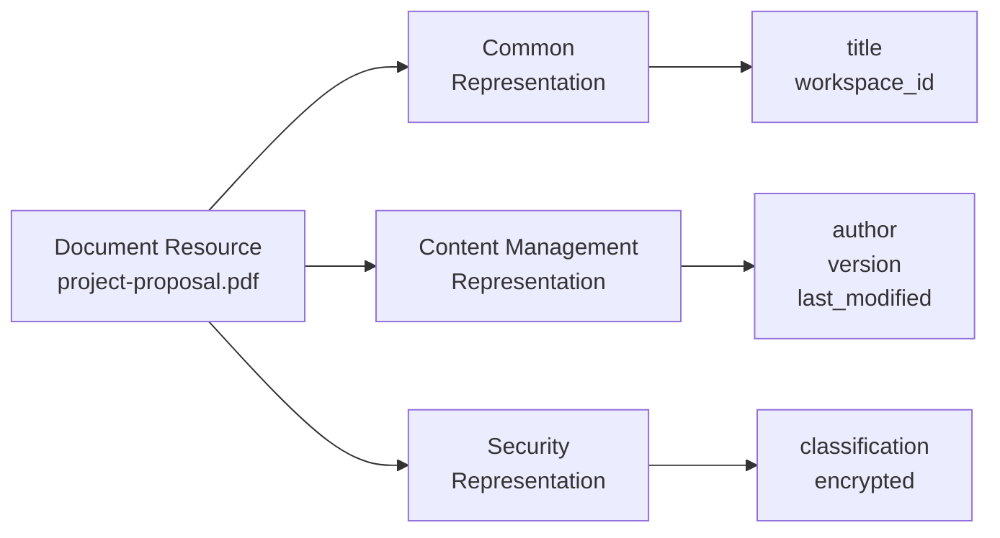

import { Aside, LinkCard } from '@astrojs/starlight/components';

Kessel is a platform for building integrated, multi-tenant services that share consistent resource organization and access semantics. At its core, Kessel treats **everything as a resource** — users, groups, workspaces, hosts, clusters, applications, and even roles are all modeled uniformly as resources with types, identifiers, and relationships.

This unified resource model enables services to share state about the same real-world entities without tight coupling. Multiple services can report their own perspective on a resource, and Kessel correlates these perspectives into a coherent view. This document explains the core concepts: resources, representations, resource types, correlation, and why you would share resource data with Kessel.

## Core Concepts

### Everything is a Resource

In Kessel, a **resource** is any addressable entity that can be modeled, queried, and governed. Resources are the fundamental building blocks of both the inventory and the authorization system.

**Examples:**
- `user:alice@redhat.com` — A user identity
- `workspace:prod-eng` — A workspace for organizing resources
- `doc:project-proposal` — A document
- `k8s_cluster:openshift-prod` — A Kubernetes cluster

The key insight is that Kessel does not distinguish between "data resources" (like documents) and "identity resources" (like users) at the model level. They are all resources with types, identifiers, attributes, and relationships to other resources.

### Resource Types

A **resource type** defines the category of a resource. Resource types are configured via schema and specify:

- Valid **representations** (different services' perspectives on the resource)
- Valid **reporters** (which services can report this resource type)
- **Correlation keys** (attributes used to link representations) — *future capability*
- **Relationships** (connections to other resource types) — *future capability*

**Example resource types:**
- `doc` — Document
- `k8s_cluster` — Kubernetes cluster
- `user` — User identity
- `group` — Group of principals

Resource types are part of Kessel's **meta-model** approach — the system does not hard-code specific resource types in its implementation. Instead, types are defined declaratively via schema, and Kessel's APIs operate generically over any configured resource type.

<Aside>
  This schema-driven approach means new resource types can be added without changing Kessel's core code. See the [Schema](../schema) documentation for how resource types are defined.
</Aside>

### Resource References

Resources are identified using a **resource reference** structure that specifies:

- `type` — The resource type (e.g., `"doc"`, `"k8s_cluster"`, `"user"`)
- `id` — The unique identifier within that type (e.g., `"project-proposal"`, `"alice@redhat.com"`)

**Example resource reference:**
```json
{
  "type": "doc",
  "id": "a4e3bc87-3ae1-470b-a881-0cde23338662"
}
```

The combination of type and ID uniquely identifies a resource within Kessel. This structure is used throughout the APIs:
- When reporting resources to the inventory (`ReportResource`)
- When creating relationships in the authorization graph (`CreateRelationship`)
- When checking permissions (`Check`)
- When querying resources (`ListResources`, `StreamedListObjects`)

**Format conventions:**
- UUIDs are preferred for service-generated IDs
- Human-readable strings are acceptable for user-facing resources (e.g., usernames, group names)
- IDs must be unique within a resource type but can be reused across different types

## Representations

A **representation** is the state of a resource. Kessel supports both common representations (shared across all reporters) and reporter-specific representations (unique to each service's perspective).

### Common vs Reporter-Specific Representations

Kessel supports two types of representations:

**Common representations** — State shared across all reporters:

Some attributes are not specific to any one reporter and represent facts about the resource itself. These go into a common representation that all reporters can contribute to.

**Reporter-specific representations** — State maintained by a specific service:

Each reporter has its own schema for the resource type. For example:
- A content management service might track author, version, and modification history
- A security service might track classification, encryption status, and compliance
- An analytics service might track view counts, unique viewers, and read time

All three services are reporting about the **same document**, but each has different attributes and concerns.

**Example: Document resource with multiple representations**



Each representation has its own schema defining valid attributes. When a service calls `ReportResource`, it specifies which representation it is updating.

## Why Share Data with Kessel?

There are two primary reasons to share resource attributes or relationships with Kessel:

### 1. You Need Them for Access Control

If access to a resource depends on an attribute or relationship, that data must be in Kessel. The authorization system evaluates permissions based on the authorization graph, which is built from resource reports.

**Examples:**
- A resource's **workspace assignment** determines which users can access it
- A resource's **owner** relationship grants management permissions
- A resource's **status** might restrict access (e.g., only production resources require elevated permissions)

**What to report:**
- Workspace relationships (required for multi-tenancy)
- Owner or group assignments
- Attributes used in permission rules (e.g., resource tags, compliance status)

### 2. Other Services or Users Need Them for Integration

If downstream services or external consumers rely on the data for automation, reporting, or decision-making, Kessel acts as the single source of truth.

**Examples:**
- Automation listening to Kafka events needs to know when a document's classification changes
- Dashboards query Kessel for current resource inventory counts
- Compliance audits pull historical state from the inventory database

**What to report:**
- Attributes that appear in dashboards or reports
- State changes that trigger workflows or alerts
- Data required for compliance or audit trails

<Aside>
  Do **not** report data just because you have it. Sending unnecessary attributes increases storage costs, replication load, and processing time. Report only what serves one of the two purposes above.
</Aside>

## Connection to the Schema

The resource types and representations described in this document are defined using **schema**. Kessel's meta-model approach means you configure resource behavior through schema rather than writing custom code.

This schema-driven design enables:
- **Extensibility** — Add new resource types without changing Kessel's implementation
- **Validation** — Enforce attribute types and constraints at write time
- **Documentation** — Schema serves as machine-readable API contracts
- **Flexibility** — Different reporters can have different schemas for the same resource type

See the [Schema](../schema) documentation for details on how resource types are defined and configured.

## Future Capabilities

The following features are planned for future releases but not yet implemented in v1beta2.

### Correlation (Planned)

<Aside type="note">
  **This feature is not yet implemented.** The correlation mechanism described below is planned but not available in the current v1beta2 release. Currently, each reporter's representation creates a separate resource in Kessel.
</Aside>

When multiple services report representations of the same resource, Kessel will need a way to determine that two representations refer to the **same logical resource**. This process is called **correlation**.

**Correlation** will be the mechanism that links multiple representations into a single resource identity. Without correlation, each service's representation is treated as a separate, unrelated resource.

**Example of planned correlation behavior:**
- Content Management service reports document with `correlation_key = "doc-uuid-123"`
- Security service reports document with `correlation_key = "doc-uuid-123"`
- Analytics service reports document with `correlation_key = "doc-uuid-123"`
- Kessel will correlate these representations because they share the same **correlation key**
- Users will see **one document** with content, security, and analytics data

**Planned correlation keys:**

**External identifiers** — Most reliable when available:
- Document UUID from storage system
- File hash (SHA-256)
- Persistent URL or URI

**Storage provider metadata**:
- Box file ID
- SharePoint document ID
- Google Drive file ID

**Content identifiers**:
- Digital Object Identifier (DOI)
- ISBN for publications
- Internal document number

**Attribute combinations**:
- Filename + workspace + creation timestamp
- Author + title + version

When this feature is implemented, correlation keys will be configured in the resource type schema, and Kessel will automatically match representations with the same correlation key values.

## Next Steps

<LinkCard
  title="Relationships and permissions"
  description="Learn how resources connect through relationships and how permissions are evaluated."
  href="/docs/building-with-kessel/concepts/relationships-permissions/"
/>

<LinkCard
  title="Identity and multi-tenancy"
  description="Understand workspaces, principals, and how tenant isolation works."
  href="/docs/building-with-kessel/concepts/tenancy/"
/>

<LinkCard
  title="Schema-driven resource model"
  description="See how resource types and representations are configured via schema."
  href="/docs/building-with-kessel/concepts/schema/"
/>

<LinkCard
  title="Report resources to inventory"
  description="Step-by-step guide to reporting resource representations."
  href="/docs/building-with-kessel/how-to/report-resources/"
/>
