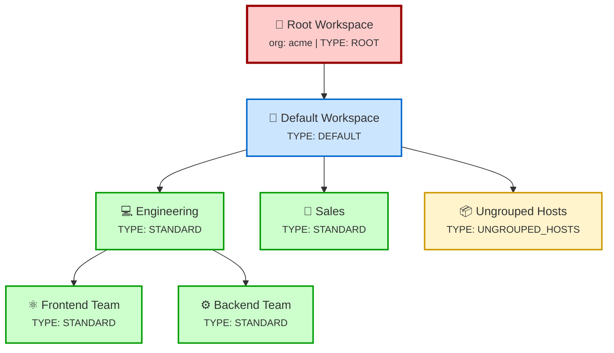

import { Aside, LinkCard } from '@astrojs/starlight/components';

Kessel provides multi-tenancy through **workspaces** — hierarchical containers that organize resources and control access. Each organization (tenant) has its own isolated workspace tree, and permissions flow through the hierarchy. This document explains how workspaces work, how they relate to organizational identity, and how Kessel enforces tenant isolation.

## Workspaces

A workspace is a container for resources that serves as a scope for permissions. When you grant a role to a user on a workspace, that user gets those permissions on all resources within that workspace and its children.

### Workspace Types

Kessel defines four workspace types:

| Type | Name | Purpose | Parent Constraints |
|------|------|---------|-------------------|
| **ROOT** | "Root Workspace" | Top of the hierarchy; contains all other workspaces | Must have no parent |
| **DEFAULT** | "Default Workspace" | Primary workspace where most resources live | Must have ROOT as parent |
| **STANDARD** | (user-defined) | User-created workspaces for organizing resources | Defaults to DEFAULT as parent if unspecified |
| **UNGROUPED_HOSTS** | "Ungrouped Hosts" | System workspace for hosts not assigned to any user workspace. Use cases: newly discovered hosts pending classification, orphaned hosts after workspace deletion, hosts with invalid workspace references | Must have a parent |

Every organization automatically gets a ROOT workspace and a DEFAULT workspace when the tenant is created. These are unique per tenant — you cannot create additional root or default workspaces.

**Example hierarchy:**



Permissions granted at ROOT cascade to all workspaces. The hierarchy enforces tenant isolation — each organization has its own separate tree.

### Workspace Hierarchy

Workspaces form a tree rooted at the ROOT workspace. The hierarchy has these properties:

**Parent-child relationships:**
- Every workspace (except ROOT) has exactly one parent
- A workspace can have multiple children
- You cannot create cycles (a workspace cannot be its own ancestor)
- Deleting a parent workspace is blocked if it has children (`on_delete=PROTECT`)

**Naming:**
- Workspace names are case-insensitively unique per parent
- Maximum 255 characters
- Two workspaces can have the same name if they have different parents

**Depth:**
- No hard limit on depth, but deep hierarchies can impact query performance
- Typical deployments rarely exceed 3-4 levels

### Permission Inheritance

Permissions granted on a parent workspace automatically apply to all descendant workspaces. This is enforced by the authorization graph tracking parent-child workspace relationships.

For example, if Alice has the `workspace_admin` role on the "Engineering" workspace, she automatically has those permissions on "Frontend Team" and "Backend Team" workspaces.

**Permission evaluation:**

When checking if a user can perform action X on workspace W, Kessel walks up the tree:

1. **Check current workspace**: Does the user have a role binding on W that grants permission X?
2. **Move to parent**: If not found, move to W's parent workspace
3. **Repeat**: Continue checking each ancestor until finding a match or reaching ROOT

This means role bindings at higher levels in the hierarchy are more powerful — granting at ROOT gives permissions across the entire organization.

<Aside type="tip">
  Use the DEFAULT workspace for organization-wide resources and create STANDARD workspaces for teams or projects that need isolated access control.
</Aside>

## Organizational Identity

Each organization (tenant) in Kessel is identified by an **org ID** — a unique string (max 36 characters) that acts as the tenant identifier across all Kessel services.

### Tenant Isolation

All RBAC data is scoped to a specific tenant:
- Each workspace, role, group, and principal belongs to exactly one tenant
- Database constraints prevent cross-tenant access
- API requests must identify the tenant

**Uniqueness guarantee**: The ROOT, DEFAULT, and UNGROUPED_HOSTS workspaces are unique per tenant. This is enforced by a database constraint on `(tenant_id, type)`.

### Public Tenant

Kessel maintains a special "public" tenant that holds shared system resources:
- **Seeded roles** — System-provided roles with predefined permissions
- **Platform default group** — The group all regular users belong to
- **Admin default group** — The group organization admins belong to

These resources are referenced by user tenants but not duplicated per tenant.

## Identity Model

### Principals

A **principal** represents an individual identity — either a human user or a service account.

**Principal types:**
- `user` — A human user authenticated via SSO/OIDC
- `service-account` — A machine identity for service-to-service calls

**Principal identifiers:**
- `user_id` — Globally unique across all tenants, assigned by the identity provider
- `username` — Unique within a tenant, stored lowercase for case-insensitive matching
- `principal_resource_id` — The authorization system identifier: `{domain}/{user_id}` (e.g., `redhat/12345`)

Principals can be marked `cross_account` to support scenarios where a user from one organization needs access to resources in another.

### Groups

A **group** is a collection of principals. Role bindings typically target groups rather than individual principals, making it easier to manage access for teams.

**Group types:**
- **Regular groups** — Created by organization admins to organize users
- **Platform default group** — All users in the organization automatically belong to this group
- **Admin default group** — Organization admins automatically belong to this group

Groups have a many-to-many relationship with principals — a principal can belong to multiple groups, and a group can contain multiple principals.

The authorization graph tracks group memberships as relationships. When a role binding targets a group, users get permissions by being members of that group.

## Workspaces and Resources

Resources in Kessel (like hosts in the inventory) are assigned to workspaces using the `workspace` relation.

**Assigning a resource to a workspace:**

When you report a resource, you can specify which workspace it belongs to. The inventory-api creates a workspace assignment relationship in the authorization graph. For example, you might assign host `host-123` to the "Engineering" workspace.

**How permissions work with resource-workspace relationships:**

When checking if a user can view a host, Kessel:
1. Finds which workspace the host belongs to
2. Follows the workspace hierarchy upward
3. Checks if the user has a role binding granting `inventory:hosts:read` on any workspace in that path

This means if Alice has `view` permission on the "Engineering" workspace, she can see all hosts assigned to Engineering or any of its child workspaces.

<Aside>
  Resources can belong to at most one workspace at a time. Reassigning a resource to a different workspace removes the old workspace relationship.
</Aside>

## Permission Scopes

Permissions in Kessel can be scoped at three levels:

| Scope | Bound To | Example Use Case |
|-------|----------|------------------|
| **Tenant** | `resource_type: "tenant"`, `resource_id: org_id` | Organization-wide permissions that apply regardless of workspace (e.g., notification settings) |
| **Root Workspace** | `resource_type: "workspace"`, `resource_id: root_workspace_uuid` | Permissions that apply across all workspaces via inheritance |
| **Workspace** | `resource_type: "workspace"`, `resource_id: workspace_uuid` | Permissions scoped to a specific workspace and its descendants |

Org-level permissions (like `notifications:notifications:read`) are bound to the tenant resource and apply organization-wide. Data-level permissions (like `inventory:hosts:read`) are bound to workspaces and respect the workspace hierarchy.

## Default Role Bindings

When a tenant is created, Kessel automatically creates 6 default role bindings to bootstrap access control:

| Scope | Subject | Role |
|-------|---------|------|
| Tenant | Admin Default Group | Org Admin role |
| Tenant | Platform Default Group | User Access role |
| Root Workspace | Admin Default Group | Workspace Admin role |
| Root Workspace | Platform Default Group | User Access role |
| Default Workspace | Admin Default Group | Workspace Admin role |
| Default Workspace | Platform Default Group | User Access role |

This ensures that:
- Organization admins have full access across all scopes
- Regular users have basic access to view resources

## Working with Workspaces

### Querying Workspaces

The RBAC service provides APIs to fetch workspaces:

**Fetch ROOT workspace:**
```
GET /api/rbac/v2/workspaces/?type=root
```

**Fetch DEFAULT workspace:**
```
GET /api/rbac/v2/workspaces/?type=default
```

**List workspaces with filtering:**
```
GET /api/rbac/v2/workspaces/?parent_id={uuid}&limit=50
```

All requests must identify the tenant.

### Workspace Assignment in Inventory

When reporting a resource to the inventory-api, include the workspace in the resource metadata:

```json
{
  "resource_type": "host",
  "resource_id": "host-123",
  "workspace_id": "engineering-workspace-uuid",
  ...
}
```

The inventory-api calls `SetWorkspace()` to create the relationship linking the resource to the workspace in the authorization graph.

## Next Steps

<LinkCard
  title="Role-based access control"
  description="Understand roles, role bindings, and how permissions are evaluated."
  href="/docs/building-with-kessel/concepts/rbac/"
/>

<LinkCard
  title="Manage access with RBAC"
  description="Learn how to create workspaces, roles, groups, and role bindings."
  href="/docs/building-with-kessel/how-to/rbac/"
/>
