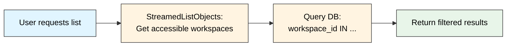
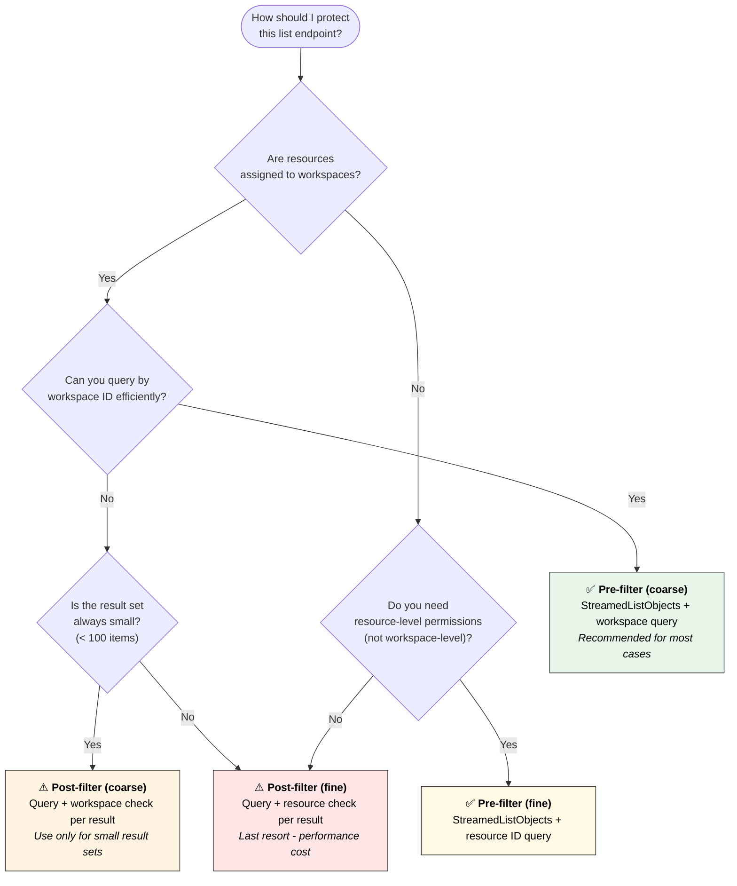

import { Aside, LinkCard, Tabs, TabItem } from '@astrojs/starlight/components';
import CodeExamples from 'src/components/CodeExamples.astro';

export const preFilterCoarse = import.meta.glob('/src/examples/protect-list/pre-filter-coarse.*', { query: '?raw', eager: true, import: 'default' });
export const preFilterFine = import.meta.glob('/src/examples/protect-list/pre-filter-fine.*', { query: '?raw', eager: true, import: 'default' });
export const postFilterCoarse = import.meta.glob('/src/examples/protect-list/post-filter-coarse.*', { query: '?raw', eager: true, import: 'default' });
export const postFilterBulk = import.meta.glob('/src/examples/protect-list/post-filter-bulk.*', { query: '?raw', eager: true, import: 'default' });

Protecting list endpoints is trickier than checking access to a single resource. Your endpoint might return 10,000 items, but the user can only see 50. You need to filter the list efficiently without checking every single item. This guide shows you the patterns you'll see in production.

## Prerequisites

This guide assumes you've already read [Protect an endpoint](/docs/building-with-kessel/how-to/protect-endpoint/) and understand how to use `Check()` and `CheckForUpdate()` for individual permission checks.

## The challenge with lists

When a user requests a list of resources, you need to answer: "Which of these can this user access?" You have two fundamental approaches:

1. **Pre-filtering**: Find out what the user can access, then query only those resources
2. **Post-filtering**: Fetch resources first, then check each one for access

Each approach has coarse-grained (workspace-level) and fine-grained (per-resource) variations. Pick the one that fits your data model and performance needs.

## Pre-filtering (recommended)

Pre-filtering reduces database load by querying only what the user can access. It provides filter criteria to your database query before fetching results.

### Coarse-grained: Workspace-level filtering

Uses `StreamedListObjects` to find all workspaces where the user has the required permission, then queries your database for resources in those workspaces.

**How it works:**

**When to use:**
- Your resources are assigned to workspaces
- Workspace membership is the primary access control mechanism
- High-cardinality resources (thousands of items or more) — per-resource checks get expensive

**Implementation:**

<CodeExamples files={preFilterCoarse} regions="get-workspaces" />

Then use those workspace IDs to filter your database query:

<CodeExamples files={preFilterCoarse} regions="filter-query" />

**What it costs:**
- **Initial cost**: One Kessel API call to get workspace list
- **Database cost**: Single filtered query (efficient with proper indexes)
- **Scales well**: Performance depends on how many workspaces the user can access, not your total resource count

<Aside type="tip">
The workspace list result can be cached for the duration of the request. If you have multiple list endpoints in the same request flow, call `StreamedListObjects` once and reuse the workspace IDs.
</Aside>

### Fine-grained: Resource-level filtering

Uses `StreamedListObjects` with your specific resource type to find exactly which resource IDs the user can access, then queries your database for only those resources.

**When to use:**
- Resources have permissions independent of workspace hierarchy
- Access is granted on individual resources, not workspace-level
- The accessible resource count stays under a few thousand

**How it works:**
1. Use `StreamedListObjects` with your resource type (not workspace) and permission
2. Get back a list of specific resource IDs the user can access
3. Query your database with `WHERE id IN (...)` for those exact IDs

**Implementation:**

<CodeExamples files={preFilterFine} regions="get-resource-ids" />

Then use those resource IDs to filter your database query:

<CodeExamples files={preFilterFine} regions="filter-query" />

**Speed tradeoffs:**
- **Kessel call**: One API call to get the resource IDs
- **Database**: `WHERE id IN (...)` query — fast with an index
- **Watch out**: If the user can access most of your resources anyway, workspace-level filtering is simpler

<Aside type="caution">
Fine-grained pre-filtering works best when the accessible resource set is bounded. If a user has access to tens of thousands of specific resources, consider coarse-grained filtering instead.
</Aside>

## Post-filtering

Post-filtering queries your database first, then checks permissions on the results before returning them to the client. Simpler to implement, but watch out — it gets inefficient with large result sets.

### Coarse-grained: Workspace-level check

Query the database first, then check if the user has permission on the workspace(s) that each resource belongs to. Filter out resources where the user lacks workspace permission.

**When to use:**
- You get the data as-is with no way to filter upfront — Kafka consumers, batch processors, or fixed API responses
- Resources are assigned to workspaces (have a `workspace_id` field)
- The result set is small enough that checking a few workspace permissions is acceptable

**How it works:**
1. Query database and get all matching resources
2. Collect the unique workspace IDs from the resources
3. Use `CheckBulk()` to verify permission on those workspaces
4. Filter out resources where the user doesn't have workspace permission

**Implementation:**

<CodeExamples files={postFilterCoarse} regions="filter-by-workspace" />

**Full example:**

<CodeExamples files={postFilterCoarse} regions="full-example" />

**The tradeoff:**
- **Database**: Unfiltered query (might fetch resources user can't access)
- **Authorization**: Check workspace permissions (fewer checks than per-resource)
- **Network**: One `CheckBulk()` call for all unique workspaces

<Aside type="note">
This is coarse-grained because you check workspace-level permissions. If the user typically has access to most workspaces in the result set, this is more efficient than pre-filtering.
</Aside>

### Fine-grained: Batch check all results

Query your database first, then use `CheckBulk` to check permission on every returned resource. The middleware filters out any resources the user cannot access before returning to the client.

**When to use:**
- Small result sets (hundreds or low thousands)
- User likely has access to most results
- Resources have per-resource permissions (not just workspace-level)
- Pre-filtering isn't possible due to permission model

**Implementation:**

<CodeExamples files={postFilterBulk} regions="bulk-check" />

**Full example:**

<CodeExamples files={postFilterBulk} regions="full-example" />

**The tradeoff:**
- **Database**: You fetch everything, even stuff the user can't see
- **Authorization**: One batched CheckBulk per 1,000 resources
- **Network**: One round-trip per batch
- **When it makes sense**: If the user can access most results anyway

<Aside type="caution">
Post-filtering with CheckBulk can waste database resources. If you query 10,000 resources but the user only has access to 100, you have over-fetched 9,900 rows. Use pre-filtering for high-cardinality resources instead.
</Aside>

## Performance considerations

| Approach | Database Load | Kessel API Calls | Best For |
|----------|---------------|------------------|----------|
| **Pre-filter (coarse)** | Low - workspace filter | 1 StreamedListObjects for workspaces | High-cardinality resources, workspace-based access |
| **Pre-filter (fine)** | Low - resource ID filter | 1 StreamedListObjects for resource IDs | Resource-level permissions, bounded accessible set |
| **Post-filter (coarse)** | Medium - varies by query | CheckBulk for unique workspaces | Data sources you can't filter upfront |
| **Post-filter (fine)** | High - unfiltered query | 1-N CheckBulk (1000 items/batch) | Small result sets, user likely accesses most |

**Key tradeoffs:**

1. **Database vs. Kessel load**: Pre-filtering trades one API call for a faster database query
2. **Cardinality**: High-cardinality resources favor pre-filtering to avoid over-fetching
3. **Access probability**: If users usually access most of the results anyway, post-filtering can work
4. **Pagination**: Pre-filtering enables efficient pagination; post-filtering can skip results unpredictably

<Aside type="tip">
**Default recommendation**: Use pre-filtering with `StreamedListObjects` at the workspace level (coarse-grained). It scales well for high-cardinality resources.
</Aside>

## Decision guide

## Real-world examples

Two Insights applications serve as reference implementations:

### Digital Roadmap: Pre-filtering with StreamedListObjects

[Digital Roadmap](https://github.com/RedHatInsights/digital-roadmap-backend) uses pre-filtering to show users only the roadmap items in workspaces they can access.

**Pattern**: 
1. Call `StreamedListObjects` to get accessible workspaces
2. Query roadmap items with `WHERE workspace_id IN (...)`
3. Return filtered results

**Key implementation**: [`src/roadmap/common.py`](https://github.com/RedHatInsights/digital-roadmap-backend/blob/main/src/roadmap/common.py) - uses `StreamedListObjects` to get accessible workspace IDs, then filters database queries with those IDs.

**Why this works**: Roadmap items are workspace-scoped, and users typically have access to fewer than 100 workspaces. Pre-filtering keeps the database query small and fast.

### Config Manager: Default workspace pattern

[Config Manager](https://github.com/RedHatInsights/config-manager) uses a simplified pattern for organization-level resources.

**Pattern**:
1. Look up the user's default workspace (their organization's root workspace)
2. Check permission on that single workspace
3. If allowed, return all resources for that organization

**Key implementation**: [`internal/http/middleware/authorization/kessel.go`](https://github.com/RedHatInsights/config-manager/blob/master/internal/http/middleware/authorization/kessel.go) - the middleware checks the default workspace permission before allowing access to organization-wide configuration.

**Why this works**: Config Manager's profiles are organization-wide settings, not workspace-scoped resources. One check tells you if the user can manage settings for their org — no need to check individual profiles.

<Aside type="note">
These are real production implementations. These patterns cover the most common scenarios for list endpoint authorization.
</Aside>

## Next steps

<LinkCard
  title="Protect an endpoint"
  description="Learn the basics of Check and CheckForUpdate for individual resource protection."
  href="/docs/building-with-kessel/how-to/protect-endpoint/"
/>

<LinkCard
  title="Relationships and permissions"
  description="Understand how workspace hierarchy and permission inheritance work."
  href="/docs/building-with-kessel/concepts/relationships-permissions/"
/>

<LinkCard
  title="Consistency model"
  description="Learn about consistency guarantees and when they matter for authorization."
  href="/docs/building-with-kessel/concepts/consistency/"
/>
