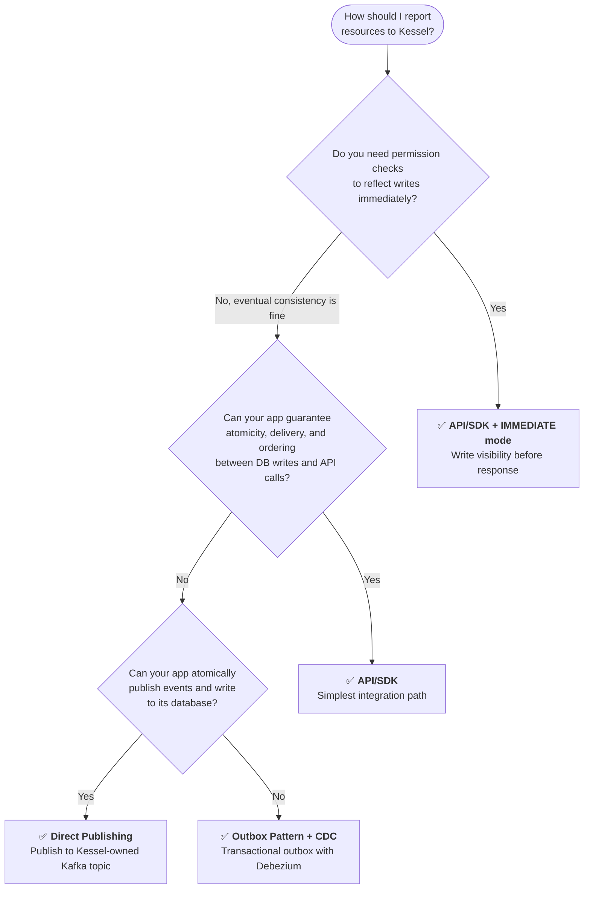

import { Aside } from "@astrojs/starlight/components";
import { LinkCard } from "@astrojs/starlight/components";

This guide provides service providers with strategies for reliably replicating data into the Management Fabric. Successful integration requires navigating the complexities of distributed systems by selecting appropriate strategies that solve for consistency, resiliency, and durability. Depending on what guarantees your system needs, you can expect to face some challenges such as the [dual-write problem](https://www.confluent.io/blog/dual-write-problem/), [write skew](https://www.cockroachlabs.com/blog/what-write-skew-looks-like/), and more. This guide will help you understand how to address these challenges and implement a replication strategy that aligns with your application's requirements.

# Reporting Resources

A resource is any entity in your application that needs access control: orders, customers, virtual machines, subscriptions, or anything else.

There are two main approaches, each with different trade-offs:

1. **Reporting via API/SDK**

- The simplest way to report resources to Kessel
- Supports immediate visibility of data changes
- Your application must guarantee atomicity, delivery, and ordering of events

2. **Reporting via Async Messaging (Kafka, Change Data Capture, etc.)**

- Better for applications that cannot guarantee delivery or ordering through direct API calls
- Only provides eventual consistency
- May require additional infrastructure

### Choosing an approach

Your reporting strategy determines what [consistency guarantees](/building-with-kessel/concepts/consistency/) are available to your application. Direct API calls support all consistency modes, including read-after-write visibility. Async approaches provide eventual consistency, meaning there is no guaranteed upper bound on how long replication to the authorization backend takes, but generally its fractions of a second. Use this flowchart to determine which strategy fits your application.



| | API/SDK | API/SDK + IMMEDIATE | Direct Publishing | Outbox + CDC |
|---|---|---|---|---|
| **Complexity** | Low | Low | Medium | Higher |
| **Write visibility** | Eventual (default) | Immediate | Eventual | Eventual |
| **Atomicity guarantee** | Caller's responsibility | Caller's responsibility | Caller's responsibility | Built-in (single DB transaction) |
| **Dual-write risk** | Yes, if not handled | Yes, if not handled | Yes, if not handled | None |
| **Ordering and delivery** | Your app must handle both | Your app must handle both | Handled by Kafka | Handled by Kafka |
| **Idempotency** | Your app must handle | Your app must handle | `transaction_id` covers Kessel API calls; additional consumer logic is your responsibility | `transaction_id` covers Kessel API calls; additional consumer logic is your responsibility |
| **Retry handling** | Your app must implement retries and persist failed requests | Your app must implement retries and persist failed requests | Consumer loop handles retries; Kafka retains uncommitted messages | Consumer loop handles retries; Kafka retains uncommitted messages |
| **Infrastructure** | None beyond Kessel | None beyond Kessel | Kafka | Kafka + Debezium |
| **Consistency modes** | All modes supported | All modes, plus guaranteed write visibility | All modes supported | All modes supported |
| **Best for** | Simple, low-volume integrations | Flows requiring read-after-write | Apps with existing Kafka infrastructure | High-volume or failure-sensitive apps |

<Aside type="tip">
  If you are unsure, start with the **API/SDK**. It is the simplest path, supports all [consistency modes](/building-with-kessel/concepts/consistency/#consistency-modes), and can use IMMEDIATE mode if you later need stronger write visibility. Move to async messaging only when your application has specific requirements around decoupling, fault tolerance, or throughput that direct API calls cannot meet. If you choose an async approach, see [Kafka Consumer Strategies](#kafka-consumer-strategies) for implementation guidance on ordering, delivery, retries, and rebalance handling.
</Aside>

## Reporting via API/SDK

Service providers can report resources directly to Kessel using gRPC API calls or one of the available SDKs for [Go](https://github.com/project-kessel/kessel-sdk-go), [Python](https://github.com/project-kessel/kessel-sdk-py), [Node.js](https://github.com/project-kessel/kessel-sdk-node), [Ruby](https://github.com/project-kessel/kessel-sdk-ruby), or [Java](https://github.com/project-kessel/kessel-sdk-java). The API schema is available in the [Buf Schema Registry](https://buf.build/project-kessel), with the primary endpoint being [`ReportResourceRequest`](https://buf.build/project-kessel/inventory-api/docs/main:kessel.inventory.v1beta2#kessel.inventory.v1beta2.ReportResourceRequest).

Direct API calls give you immediate visibility and synchronous error handling, which makes them a good fit for simple integrations. However, your application is responsible for atomicity, guaranteed delivery, and ordering. The API does not provide built-in consistency or durability guarantees if your application fails between database writes and API calls.

## Reporting via Async Messaging

Asynchronous messaging is a good alternative when your application needs decoupled, fault-tolerant data replication. Unlike direct API calls that can fail due to network issues or service unavailability, async messaging offers built-in resilience through message persistence, retries, and eventual consistency. This approach works well for high-volume applications or those that cannot block business operations while waiting for external acknowledgments.

### Direct Publishing

Your application can publish resource events directly to a Kessel-owned Kafka topic for resource ingestion. You will need to make sure your event publishing and database writes happen atomically. You may need to implement a pattern like an outbox to achieve this.

### Change Data Capture (CDC)

Change Data Capture is a technique that allows you to capture changes to specific database tables and publishes them to a message broker. This is more robust than direct API calls for applications that cannot guarantee delivery or ordering, but comes with additional infrastructure and latency. Our recommended CDC tool is [Debezium](https://debezium.io/), which attaches to your database and publishes changes to a Kafka topic.

#### Why Use CDC?

Writing to your database and publishing events to a message broker are two separate operations that cannot happen atomically in many cases (the [dual-write problem](https://www.confluent.io/blog/dual-write-problem/)). If your application crashes after the database write but before publishing the event, your database and message consumers can get permanently out of sync. CDC solves this by publishing events only when database transactions are successfully committed.

## The Outbox Pattern

The outbox pattern writes both your business data and messaging events within the same database transaction, using a dedicated outbox table. When paired with [Debezium](https://debezium.io/) for CDC, the outbox table feeds events to a message broker, keeping your database and downstream consumers eventually in sync.

### The Outbox Table

This example follows a similar structure to the [Debezium Outbox Event Router](https://debezium.io/documentation/reference/stable/transformations/outbox-event-router.html#basic-outbox-table) example.

```sql
CREATE TABLE outbox (
    id UUID NOT NULL,
    aggregatetype VARCHAR(255) NOT NULL,
    aggregateid VARCHAR(255) NOT NULL,
    version VARCHAR(255) NOT NULL,
    operation VARCHAR(255) NOT NULL,
    payload JSONB,
    PRIMARY KEY (id)
);
```

**Column Breakdown:**

- **id:** A unique identifier for each event (primary key)
- **aggregatetype:** The type of business entity the event relates to (e.g. `customer`, `order`).
  Debezium uses this to determine the destination topic.
- **aggregateid:** The unique identifier of the specific entity instance (e.g. customer ID, order number).
- **version:** The Kessel API version of the event (e.g. `v1beta2`)
- **operation:** The Kessel API method to call when processing the event (e.g. `ReportResource`)
- **payload:** The event content. This should match the request body of the `ReportResourceRequest` API call.

### Writing to the Outbox

With the outbox table in place, you'll need to modify your application's business logic to write to it within the same
transaction as your primary data changes.

For example, creating a new customer and publishing an event about it:

```sql
BEGIN;
INSERT INTO customers (id, name) VALUES ('123', 'John Doe');
INSERT INTO outbox (id, aggregatetype, aggregateid, version, operation, payload)
VALUES ('456', 'customer', '123', 'v1beta2', 'ReportResource', '{"type":"customer","reporter_type":"my-reporter","reporter_instance_id":"redhat","representations":{"metadata":{"..."},"common":{"..."},"reporter":{"..."}}}');
COMMIT;
```

This ensures both the customer record and the outbox event are created atomically. If the transaction fails, neither is written.

### Transaction IDs and Idempotency

The Inventory API supports a `transaction_id` field on `ReportResourceRequest` (via `ResourceRepresentations, under RepresentationMetadata.transaction_id`) that enables idempotent processing. If a request arrives with a `transaction_id` that has already been processed, the API skips it silently.

For outbox-based integrations, include the `transaction_id` in your outbox event's `payload` field under RepresentationMetadata, since the payload mirrors the API request body. Review the [protobuf](https://buf.build/project-kessel/inventory-api/docs/main%3Akessel.inventory.v1beta2#kessel.inventory.v1beta2.RepresentationMetadata) for more details.

### Pruning the Outbox

To prevent the outbox table from growing indefinitely, you need a cleanup strategy.

With Debezium, since it reads from the [write-ahead log](https://www.postgresql.org/docs/current/wal-intro.html), you can safely delete entries from the outbox table immediately, even within the same transaction that created them.

```sql
BEGIN;
INSERT INTO customers (id, name) VALUES ('123', 'John Doe');
INSERT INTO outbox (id, aggregatetype, aggregateid, version, operation, payload)
  VALUES ('456', 'customer', '123', 'v1beta2', 'ReportResource', '{"type":"customer","reporter_type":"my-reporter","reporter_instance_id":"redhat","representations":{"metadata":{"..."},"common":{"..."},"reporter":{"..."}}}');
DELETE FROM outbox WHERE id = '456';
COMMIT;
```

If you need to retain history for auditing, debugging, or recovery, consider a retention policy or reconciler that archives old events to a separate table or long-term store. Note that retained events will not be ordered by transaction commit order inherently. You may need additional mechanisms like a serial primary key to ensure ordering.

<Aside type="tip">
Even if you delete outbox rows immediately, consider logging or archiving events before deletion. Retained outbox history can be critical for detecting inconsistencies between your database and Kessel, such as failed resource deletions that leave stale authorization data.
</Aside>

### Monitoring

**Outbox Event Creation**: Track the rate of event creation alongside event consumption to identify lag in your system. If the outbox is filling up faster than events are processed, you may need to scale your consumers or optimize event processing.

See our **Monitoring Data Replication** guide for more details.

<LinkCard
  title="Monitoring Data Replication in Inventory API"
  href="/running-kessel/monitoring-kessel/monitoring-data-replication-inventory-api/"
/>

### Beware: Write Skew

Interleaved database writes can lead to [write skew issues](https://www.cockroachlabs.com/blog/what-write-skew-looks-like/), where concurrent read-modify-write cycles operate on stale data and cause silent corruption. Keep this in mind when designing your outbox and event processing logic.

## Immediate Write Visibility with Asynchronous Messaging

If you need immediate visibility of data changes but are using asynchronous event processing, consider using Postgres [LISTEN](https://www.postgresql.org/docs/current/sql-listen.html) and [NOTIFY](https://www.postgresql.org/docs/current/sql-notify.html) in your application's database. This lets your request handler wait for a notification about the outcome of event consumption (e.g. replication to Kessel) before returning to the client. Note, this is not a Kessel feature, but a pattern you can implement in your own service.

### How it works

The process is fairly straightforward:

- **Produce & Listen:** The request handler produces an event to a Kafka topic (directly or via an outbox table) and begins LISTENing on a Postgres channel.
- **Consume & Notify:** A separate consumer processes the event. On completion, it issues a NOTIFY to the channel the request handler is listening on.
- **Synchronize:** The request handler receives the notification, confirming the event was processed, and can return a response to the client.

This creates a synchronous workflow on top of the async pipeline, so request handlers can wait for downstream processing to complete.

### Examples

#### Listening on a Postgres channel

To listen for notifications on a specific Postgres channel, use the `LISTEN` command. Channels are arbitrary strings you define to group related notifications.

```sql
LISTEN "host-replication";
```

#### Notifying a Postgres channel

Send a notification to all listeners on a channel. The payload can be any string. In this example it is a UUID that identifies the specific event or request.

```sql
NOTIFY "host-replication", 'c0740fcd-c2a3-4767-b2d2-fd21cd12e31a';
```

### Considerations

- LISTEN/NOTIFY may not be supported by all database drivers. Check that your Postgres driver handles it.
- Postgres channels are not durable. If the request handler is not actively listening when the NOTIFY fires, it misses the notification. Start listening before producing the event.
- Avoid creating and dropping channels frequently. Use a consistent channel name for each event type. Multiple listeners can share the same channel; use identifiers in the notification payload to distinguish events.
- LISTEN/NOTIFY should use its own database connection, separate from your application logic. It is a long-lived operation that can block other operations on the same connection. Reuse connections rather than creating a new one per LISTEN.

## Kafka Consumer Strategies

If your async integration involves building your own consumer to process events and call the Kessel API, this section covers the key challenges and strategies for making it reliable.

We built our consumer in Go using the [confluent-kafka-go](https://github.com/confluentinc/confluent-kafka-go) client library.

### Why Use a Kafka Consumer for Replication?

A Kafka consumer decouples your primary service from the replication process. This ensures issues in the replication pipeline won't directly impact your main application's performance.

### Key Guarantees for Data Integrity

To keep data consistent between your service and Kessel, your consumer should enforce these three guarantees:

1. **Messages must be processed in order:**
   For example, processing an `update` before a `create` for the same record will fail and cause data issues.

2. **Guarantee at-least-once processing:**
   Never skip a message. Do not move to the next message until the current one is confirmed processed. Without this, you risk permanent inconsistency for skipped events.

3. **Processing should be idempotent:**
   If a message is processed more than once, it should not cause side effects or data corruption. If a historical message is replayed, all subsequent messages must also be reprocessed in order.

### Authentication

To read from a secured Kafka cluster, your consumer must authenticate with the brokers. For our setup we use SASL with the SCRAM-SHA-512 mechanism.

A typical configuration:

```yaml
security-protocol: sasl_plaintext
sasl-mechanism: SCRAM-SHA-512
sasl-username: my-generic-consumer
sasl-password: <PASSWORD>
```

Your consumer configuration must include properties like `security.protocol`, `sasl.mechanism`, and related settings for a successful connection.

### Retry Logic

Message processing can fail for transient reasons (network issues) or permanent ones (malformed messages). A robust consumer must handle failures without halting all processing.

Our implementation uses two retry layers:

1. **Operation-level Retry:**
   For transient failures within a specific task, a blocking retry function retries with exponential backoff.

```go
// retry executes the given operation with exponential backoff.
// Set maxRetries to -1 for unlimited retries.
func retry(operation func() error, maxRetries int, initialBackoff time.Duration) error {
    backoff := initialBackoff
    for attempt := 0; maxRetries == -1 || attempt < maxRetries; attempt++ {
        err := operation()
        if err == nil {
            return nil
        }
        log.Printf("attempt %d failed: %v, retrying in %s", attempt+1, err, backoff)
        time.Sleep(backoff)
        backoff *= 2
    }
    return fmt.Errorf("operation failed after %d retries", maxRetries)
}
```

This retries a failing operation synchronously with exponential backoff up to a configured maximum. Because it uses `time.Sleep`, it blocks the consumer's main processing loop.

2. **Consumer-Level Retry:**
   If the consume loop cannot recover (e.g. the consumer connection is closed), a more drastic retry recreates the entire consumer connection.

```go
// runConsumerWithRetry creates a Kafka consumer and begins polling.
// If the consumer closes unexpectedly, it recreates the connection
// and resumes from the last committed offset.
// Set maxRetries to -1 for unlimited retries.
for maxRetries == -1 || retries < maxRetries {
    consumer, err := createConsumer(config)
    if err != nil {
        log.Printf("failed to create consumer: %v", err)
        retries++
        time.Sleep(backoff)
        continue
    }

    err = consumer.Poll(ctx)
    if errors.Is(err, ErrConsumerClosed) {
        log.Printf("consumer closed unexpectedly, recreating (attempt %d)", retries+1)
        retries++
        time.Sleep(backoff)
        backoff *= 2
        continue
    }
    break
}
```

This forces a re-read from the last committed offset, preventing message loss.

### Rebalances

Rebalances are critical to handle correctly. If your consumer loses a partition without saving its progress, the next consumer will start from the last saved point, leading to duplicate processing.

Our consumer handles partition reassignments by registering a `RebalanceCallback` that commits progress before partitions are lost.

```go
// rebalanceCallback handles Kafka partition reassignments.
// When partitions are revoked, it commits the current offsets
// to prevent the next consumer from reprocessing completed messages.
func rebalanceCallback(consumer *kafka.Consumer, event kafka.Event) error {
    switch ev := event.(type) {
    case kafka.RevokedPartitions:
        log.Printf("partitions revoked: %v", ev.Partitions)

        _, err := consumer.Commit()
        if err != nil {
            log.Printf("failed to commit offsets during rebalance: %v", err)
            return err
        }
    case kafka.AssignedPartitions:
        log.Printf("partitions assigned: %v", ev.Partitions)
    }
    return nil
}
```

When the consumer is notified it is about to lose partitions, it commits offsets. This prevents the next consumer from reprocessing already-completed messages.

### Leveraging Client Statistics

Most Kafka client libraries can emit internal performance statistics as JSON. These provide a real-time view of your consumer client's health.

To enable this, set `statistics.interval.ms` to a non-zero value (e.g. 60000 for every 60 seconds). The client will periodically report metrics such as:

- **Round-trip time (rtt)**
- **Total messages consumed (rxmsgs)**

These metrics are useful for debugging and can feed into dashboards and alerts.

### Deployment

How you deploy your consumer has a few key considerations:

1. **In-process thread (used by the Kessel team)**

- Runs as a thread within the main application process
- Simple to deploy with no network overhead
- Tightly coupled resources: a CPU-intensive task in the main application can starve the consumer and vice versa
- Cannot scale the consumer independently

2. **Sidecar container**

- Runs in its own container within the same pod
- Decoupled resources with independent CPU and memory limits
- Allows independent scaling and focused monitoring

3. **Standalone pod** (also used by the Kessel team)

- Runs as a completely separate deployment
- Maximum decoupling of resources, scaling, and lifecycle
- Highest operational complexity with separate deployment, monitoring, and alerting
- Can be overkill if the consumer logic is tightly coupled to a single application
