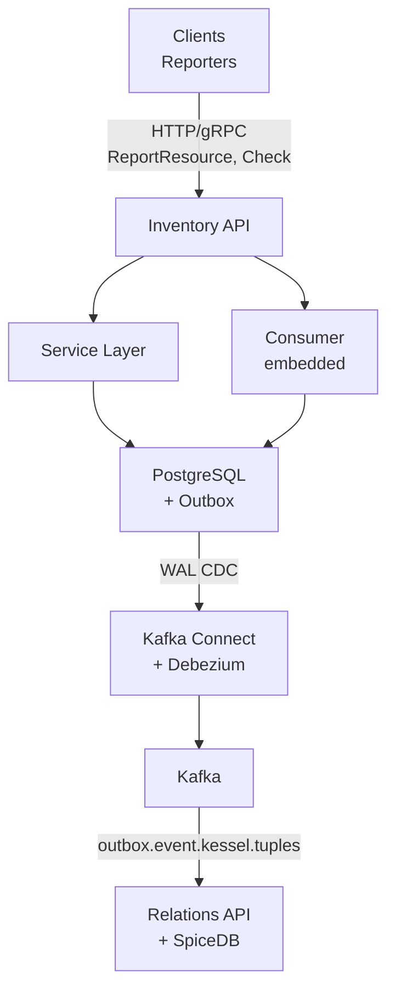
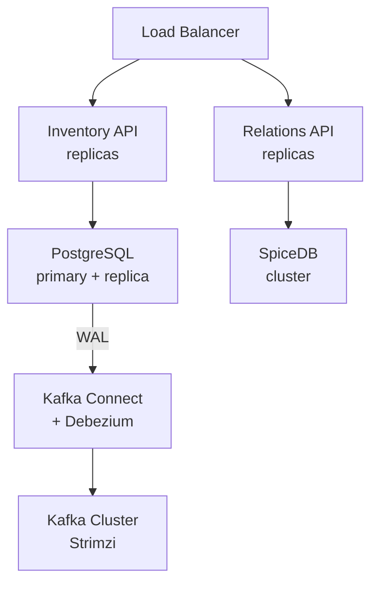

{/* Updated from source analysis:
     - inventory-api: main@fe0b12d8 (2026-04-09) - Business metrics, bulk checks, StreamedListSubjects, stream interceptors
     - relations-api: main@8dbd57c (2026-04-09) - CheckBulkForUpdate
     - kessel-sdk-go: main@cc80493 (2026-04-09) - RBAC v2, bulk check examples
*/}

import { Aside } from '@astrojs/starlight/components';

Kessel is a distributed system that provides unified inventory and authorization services. This document explains how Kessel's components work together to deliver its core capabilities: resource lifecycle management, relationship-based access control, and change event propagation.

## System Overview

Kessel consists of three main components:

1. **Inventory API** - The primary service for reporting resources and checking permissions
2. **Relations API + SpiceDB** - The authorization backend that stores and evaluates relationship-based permissions
3. **Data Replication Pipeline** - Kafka-based CDC (Change Data Capture) system that synchronizes data between components



## Core Components

### Inventory API

The Inventory API is the central service, implemented in Go using the Kratos framework. It exposes both HTTP (default port 8000) and gRPC (default port 9000) endpoints for the v1beta2 API.

**Key responsibilities:**
- Accept resource reports from services (reporters)
- Validate resources against schemas
- Store resource data in PostgreSQL
- Route permission checks to Relations API (single and bulk)
- Publish change events via outbox pattern
- Consume Kafka events to maintain consistency tokens
- Collect and expose business metrics (optional)

**Internal Architecture** (Clean Architecture pattern):
- **Service Layer** - Translates between protobuf/HTTP and domain models
- **Usecase Layer** - Orchestrates business operations
- **Domain Model** - Core business logic and interfaces
- **Data Layer** - Persistence via GORM (PostgreSQL)

**Embedded Consumer:**
The consumer runs as a goroutine within the inventory-api process (when the consumer is enabled via config: `enabled: true`). It subscribes to Kafka topics, processes outbox events, and replicates relationship tuples to SpiceDB via the Relations API.

**Business Metrics Collector (optional):**
When enabled, a background goroutine reads pre-computed metrics from the database every 24 hours and exposes them as Prometheus/OpenTelemetry metrics. Metrics are computed offline by a separate CronJob to avoid expensive SQL aggregations on live API replicas. Tracks resource counts by type, workspace, and reporter for operational visibility.

### Relations API + SpiceDB

The Relations API is a separate service (from `project-kessel/relations-api`) that provides the authorization backend. It wraps **SpiceDB**, a Google Zanzibar-inspired authorization database.

**Key responsibilities:**
- Evaluate permission checks (Check, CheckSelf, CheckForUpdate)
- Evaluate bulk permission checks (CheckBulk, CheckSelfBulk, CheckForUpdateBulk)
- Store relationship tuples (user-resource permissions)
- Stream query results (StreamedListObjects, StreamedListSubjects)
- Manage consistency tokens (ZedTokens)
- Provide partition locks for consumer fencing

SpiceDB stores the actual relationship graph and evaluates permissions using the compiled KSL schema.

### KSL Schema

Kessel uses the Kessel Schema Language (KSL) to define authorization schemas. KSL files (`.ksl`) are compiled into SpiceDB-compatible `.zed` schema files by an external compiler. These schemas define:
- Resource types
- Relationship types
- Permission derivation rules
- RBAC model extensions

### PostgreSQL Database

The primary data store with four main tables:

| Table | Purpose |
|-------|---------|
| `resource` | Canonical inventory resource (UUID v7 ID, type, version, consistency token) |
| `reporter_resources` | One row per reporter-resource combo, with composite unique key |
| `common_representations` | Versioned JSON data shared across reporters |
| `reporter_representations` | Versioned reporter-specific JSON data |
| `metrics_summary` | Pre-computed business metrics (JSONB), updated by CronJob |

**Key features:**
- Serializable transaction isolation
- Logical replication via `pgoutput` plugin
- LISTEN/NOTIFY for read-after-write consistency
- Transactional outbox (WAL or table mode)

### Kafka + Debezium

**Apache Kafka** serves as the message bus for change events. Key topics:
- `outbox.event.kessel.resources` - Resource lifecycle events
- `outbox.event.kessel.tuples` - Relationship tuple events

**Kafka Connect + Debezium** captures PostgreSQL WAL changes:
- Uses `pgoutput` logical replication
- Debezium Outbox Event Router SMT routes events by aggregate type
- Captures logical decoding messages (WAL mode) or table changes (table mode)

## Data Flows

### Resource Reporting Flow

When a client reports a resource (create or update):

1. **Request** - Client sends `ReportResource` via HTTP POST or gRPC
2. **Authentication** - OIDC, x-rh-identity, or allow-unauthenticated
3. **Meta-Authorization** - Check if caller can report resources
4. **Schema Validation** - Validate against resource type schema
5. **Transaction ID** - Generate UUID v7 for idempotency
6. **Read-After-Write Setup** (optional) - Subscribe to PostgreSQL LISTEN channel
7. **Database Transaction** (serializable):
   - Find or create resource
   - Upsert reporter_resource + representations
   - Publish TWO outbox events:
     - `kessel.resources.*` event (resource lifecycle)
     - `kessel.tuples.*` event (relationship tuples)
8. **CDC Pipeline**:
   - Debezium captures WAL changes
   - Routes events to Kafka topics
9. **Consumer Processing**:
   - Reads tuple event from Kafka
   - Calculates tuple changes (create/delete)
   - Calls Relations API to update SpiceDB
   - Writes consistency token back to resource table
   - Sends PostgreSQL NOTIFY (for read-after-write)
10. **Response** - Client receives success

### Permission Check Flow

When a client checks permissions:

1. **Request** - Client sends one of:
   - **Single checks**: `Check`, `CheckSelf`, `CheckForUpdate`
   - **Bulk checks**: `CheckBulk` (up to 1000 items), `CheckSelfBulk`, `CheckForUpdateBulk`
2. **Authentication** - Identify the caller
3. **Meta-Authorization** - Check if caller can perform checks
4. **Consistency Token Resolution**:
   - `minimize_latency` - No token (fastest, may be stale)
   - `at_least_as_fresh` - Use caller-provided token
   - `at_least_as_acknowledged` - Lookup from resource table (`ktn` column)
   - Note: `CheckBulk` does not support `at_least_as_acknowledged` (no single resource anchor for multiple checks)
5. **Delegate to Relations API** - Convert to Relations API request format
6. **SpiceDB Evaluation** - Evaluate permission using stored tuples + schema
7. **Response**:
   - Single checks: Return allowed/denied + optional consistency token
   - Bulk checks: Return array of pairs (request item + allowed/error per item) + consistency token

**Bulk Check Variants:**

| Variant | Subject | Consistency | Use Case |
|---------|---------|-------------|----------|
| `CheckBulk` | Explicit per item | Optional (no `at_least_as_acknowledged`) | Service-to-service batch authorization for arbitrary subjects |
| `CheckSelfBulk` | Derived from caller | Optional | UI rendering: "which of these N resources can I access?" |
| `CheckForUpdateBulk` | Explicit per item | Always strong (inherits `CheckForUpdate` semantics) | Pre-flight checks before batch mutations |

All bulk responses use the same pattern: array of `{item, response}` pairs where each response is either `{allowed: bool}` or `{error: google.rpc.Status}`, allowing partial success.

### Delete Resource Flow

When a client deletes a resource:

1. **Request** - Client sends `DeleteResource` via HTTP DELETE or gRPC
2. **Authentication + Authorization**
3. **Database Transaction**:
   - Find resource by key
   - Mark as deleted (tombstone flag)
   - Publish outbox delete events
4. **CDC Pipeline** - Same as report flow
5. **Consumer** - Deletes relationship tuples from SpiceDB
6. **Response** - Client receives confirmation

### List Subjects Flow (Streaming)

When a client queries "who has access to this resource?":

1. **Request** - Client sends `StreamedListSubjects` with:
   - `resource` - The target resource
   - `relation` - The permission/relation to check (e.g., "viewer", "editor")
   - `subject_type` - Filter subjects to this type (e.g., "principal", "group")
   - Optional: `subject_relation`, `pagination`, `consistency`
2. **Authentication + Authorization**
3. **Delegate to Relations API** - Convert to SpiceDB lookup subjects query
4. **SpiceDB Streaming Query** - Evaluate and stream matching subjects
5. **Response Stream** - Server sends `SubjectReference` objects one at a time
6. **Client Processing** - Client iterates stream, handles pagination tokens

This is the inverse of `StreamedListObjects` (which answers "what can subject X access?"). Use cases include access review, audit trails, and admin tooling ("show me all users who can edit this workspace").

## Key Architectural Patterns

### Transactional Outbox Pattern

Kessel uses the outbox pattern to guarantee atomicity between database writes and event publishing. Two implementation modes:

**WAL Mode** (recommended):
```sql
SELECT pg_logical_emit_message(
  true,  -- transactional
  'kessel.tuples',
  jsonb_build_object('operation', 'CREATE', 'payload', ...)::text
);
```
- Writes messages directly to PostgreSQL WAL
- No separate outbox table overhead
- Debezium captures via `DecodeLogicalDecodingMessageContent`

**Table Mode** (legacy):
- INSERT then DELETE on outbox table
- Debezium captures INSERT before DELETE propagates

<Aside type="tip">
  Each resource operation emits **two** outbox events: one for resource lifecycle (`kessel.resources`) and one for relationship tuples (`kessel.tuples`). This separation allows different consumers to process each event type independently.
</Aside>

### Change Data Capture (CDC)

Debezium's PostgreSQL connector monitors the WAL using the `pgoutput` plugin:

```
PostgreSQL WAL
  → Debezium Connector
  → Outbox Event Router SMT (routes by prefix)
  → Kafka Topics (kessel.resources, kessel.tuples)
  → Consumer
```

**Configuration highlights:**
- Excludes all tables (`table.exclude.list: .*`)
- Only captures logical messages with prefixes `kessel.tuples` and `kessel.resources`
- Uses `EventRouter` transform to extract aggregate type, ID, operation

### Read-After-Write Consistency

For operations requiring immediate visibility (e.g., report resource then check permission):

1. Client sets `write_visibility = IMMEDIATE`
2. API subscribes to PostgreSQL LISTEN channel (`consumer_notifications`)
3. Transaction commits and outbox event flows to Kafka
4. Consumer processes event, updates SpiceDB, sends NOTIFY
5. API handler receives notification and unblocks
6. Client receives response

**Circuit Breaker Protection:**
- Protects against consumer unavailability
- Trips after 3 consecutive failures
- Resets after 60 seconds

<Aside type="caution">
  Read-after-write consistency adds latency (typically 100-500ms) as it waits for the full CDC pipeline. Use `minimize_latency` for read-heavy workloads where eventual consistency is acceptable.
</Aside>

### Consistency Token Management

SpiceDB returns **ZedTokens** (consistency tokens) after tuple operations. The flow:

1. Consumer updates SpiceDB tuples
2. SpiceDB returns ZedToken
3. Consumer writes token to `resource.ktn` column
4. API permission checks can use this token for `at_least_as_acknowledged` consistency

**Consistency Modes:**

| Mode | Token Source | Guarantees | Latency |
|------|-------------|------------|---------|
| `minimize_latency` | None | May read stale data | Lowest |
| `at_least_as_fresh` | Caller provides | Sees at least caller's view | Medium |
| `at_least_as_acknowledged` | Lookup from DB | Sees committed state | Higher |

### Fencing Tokens for Consumer Safety

To prevent stale consumers from conflicting writes after Kafka partition rebalances:

1. Consumer acquires lock from Relations API (`AcquireLock`) on partition assignment
2. All tuple operations include `FencingCheck` with lock token
3. SpiceDB rejects operations from stale lock tokens
4. Consumer releases lock on partition revocation

This implements [distributed fencing tokens](https://martin.kleppmann.com/2016/02/08/how-to-do-distributed-locking.html) to prevent unsafe concurrent operations after rebalances.

### Schema Validation

Resource schemas are defined in `data/schema/resources/` with structure:

```
{resource_type}/
  common_representation.json     # JSON Schema for shared data
  reporters/{reporter}/
    {resource_type}.json         # Reporter-specific JSON Schema
```

The `SchemaService` validates incoming reports against these JSON schemas before persisting. Validation uses the JSON Schema format to check both the common representation and reporter-specific representations.

### Serializable Transactions

All database operations use **serializable isolation** to prevent race conditions:
- GORM session with `IsolationLevel: SerializableLevel`
- Automatic retry on serialization failures
- Configurable `max-serialization-retries`

### Clean Architecture Layering

The codebase follows clean architecture with strict boundaries:

```
Proto/API → Service (transport) → Usecase (application) → Biz (domain) → Data (persistence)
```

- Each layer has its own models
- Dependencies point inward (data layer doesn't know about HTTP)
- Service layer translates between protobuf and domain types

### Business Metrics Collection

Kessel provides operational visibility into resource inventory without impacting API performance:

**Two-tier architecture:**

1. **CronJob (writer)** - Runs as a Kubernetes CronJob on a configurable schedule (e.g., hourly or daily). Executes SQL aggregations against the PostgreSQL database, computes metrics summaries, and writes results as JSONB to the `metrics_summary` table. Sets `work_mem = '256MB'` to optimize large hash joins.

2. **Background goroutine (reader)** - Runs in each API replica when enabled. On startup and every 24 hours thereafter, reads the latest `metrics_summary` row and exposes values as OpenTelemetry metrics (Prometheus-compatible).

**Metrics exposed:**

| Metric | Type | Labels | Description |
|--------|------|--------|-------------|
| `kessel_inventory_resources_per_workspace` | Float64Histogram | `resource_type` | Distribution of resource counts per workspace |
| `kessel_inventory_resource_count` | Int64Gauge | `resource_type`, `reporter_name`, `reporter_id` | Total resource count by type and reporter |

**Why this design?** Running these SQL aggregations on live API replicas would add latency and CPU load. By pre-computing metrics in a separate job, the API only performs a single lightweight `SELECT ... ORDER BY collected_at DESC LIMIT 1` query.

**Grafana dashboards** ship with the deployment (`grafana-dashboard-kessel-inventory-business-metrics.configmap.json`).

### Stream Logging and Validation

For streaming gRPC endpoints (`StreamedListObjects`, `StreamedListSubjects`), Kessel uses specialized interceptors:

**Stream Logging Interceptor:**
- Logs stream lifecycle events (open, first message, close) with unique stream IDs
- Tracks sent/received message counts using atomic counters
- Maps gRPC status codes to HTTP-equivalent log levels
- Avoids per-message logging (which would generate ~765 bytes × millions of messages)

**Stream Validation Interceptor:**
- Wraps `RecvMsg` to validate every incoming message against protobuf validation rules
- Returns `BadRequest` errors before the handler sees invalid messages
- Does not validate outgoing messages (server controls output)

**Why separate from unary middleware?** Kratos middleware runs per-message for streams, which overwhelms logging systems at high throughput. These interceptors run once per stream (logging) or per received message (validation) with optimized resource usage.

## External Dependencies

| Dependency | Purpose | Required |
|------------|---------|----------|
| PostgreSQL (with logical replication) | Primary data store, WAL CDC source | Yes |
| Apache Kafka | Event streaming bus | Yes |
| Kafka Connect | CDC connector runtime | Yes |
| Debezium | PostgreSQL CDC connector | Yes |
| SpiceDB | Authorization graph database | Yes |
| Relations API | SpiceDB frontend wrapper | Yes |
| Keycloak | OIDC identity provider | Optional (dev/test) |
| Prometheus/Grafana | Monitoring and dashboards | Optional |

## Deployment Architecture

### Typical Production Setup



### Scaling Considerations

- **Inventory API**: Stateless, horizontally scalable
- **Consumer**: Scales with Kafka partitions (one consumer per partition)
- **PostgreSQL**: Vertical scaling, read replicas for queries
- **Kafka**: Partition count determines parallelism
- **SpiceDB**: Horizontally scalable via sharding

## Monitoring & Observability

Key metrics to monitor:

- **Inventory API**: Request latency, error rate, transaction duration
- **Consumer**: Kafka lag, tuple operation rate, fencing failures
- **CDC Pipeline**: Debezium connector lag, WAL slot size
- **PostgreSQL**: Connection pool, transaction conflicts, replication lag
- **Relations API**: Check latency, tuple operation latency
- **SpiceDB**: Query latency, consistency token skew

See [Monitoring Kessel](../monitoring-kessel/) for detailed monitoring guidance.

## Security Model

### Authentication

Supports multiple auth methods via chain-of-authenticators:
1. **OIDC** - OAuth 2.0 / OpenID Connect (production)
2. **x-rh-identity** - Red Hat SSO header (platform services)
3. **allow-unauthenticated** - Development only

### Authorization Layers

1. **Meta-Authorization** - Controls who can call API operations
2. **Resource-Level Authorization** - SpiceDB-based relationship checks

### Data Security

- TLS in transit (configurable per endpoint)
- PostgreSQL connections encrypted
- Kafka SASL/TLS support
- Secrets management via Kubernetes secrets

## High Availability

### Failure Modes

| Component Failure | Impact | Recovery |
|-------------------|--------|----------|
| Inventory API pod | Load balancer routes to healthy pods | Automatic (K8s) |
| PostgreSQL primary | Downtime until failover | Manual/automated failover |
| Kafka broker | Topic replication preserves data | Automatic rebalancing |
| Consumer | Partition reassignment | Kafka consumer group rebalance |
| Relations API | Permission checks fail | Load balancer routes to healthy pods |
| SpiceDB | Authorization unavailable | SpiceDB cluster failover |

### Data Durability

- **PostgreSQL**: WAL archiving + point-in-time recovery
- **Kafka**: Topic replication (min.insync.replicas)
- **SpiceDB**: Clustered deployment with data replication

## Performance Characteristics

Typical latencies (production scale):

- **ReportResource** (eventual): 5-20ms
- **ReportResource** (immediate visibility): 100-500ms
- **Check** (minimize_latency): 10-50ms
- **Check** (at_least_as_acknowledged): 20-80ms
- **Consumer throughput**: 1000-5000 resources/sec (depends on tuple count)

<Aside>
Performance varies significantly based on:
- Consistency mode selected
- Number of relationship tuples per resource
- Kafka partition count
- SpiceDB cluster size
- Network latency between components
</Aside>

## Development vs Production

### Development Setup

- Single-node PostgreSQL (no replication)
- Kafka Connect in standalone mode
- `allow-unauthenticated` auth
- `allow-all` authorization
- WAL outbox mode
- Consumer enabled in same process

### Production Requirements

- PostgreSQL with replication
- Kafka Connect cluster (distributed mode)
- OIDC authentication
- Kessel authorization
- Multi-replica deployment
- Separate consumer processes (optional)
- Monitoring and alerting

## Further Reading

- [Consistency Concepts](../../building-with-kessel/concepts/consistency) - Deep dive into consistency modes
- [Events](../../building-with-kessel/concepts/events) - Event schema and patterns
- [Resources & Representations](../../building-with-kessel/concepts/resources-representations) - Resource model details
- [RBAC Model](../../building-with-kessel/concepts/rbac) - Permission and relationship patterns
- [Monitoring Kessel](../monitoring-kessel/) - Operational monitoring guide
