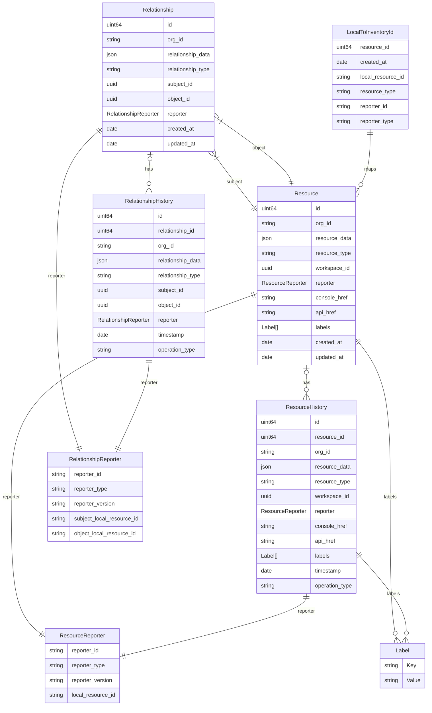
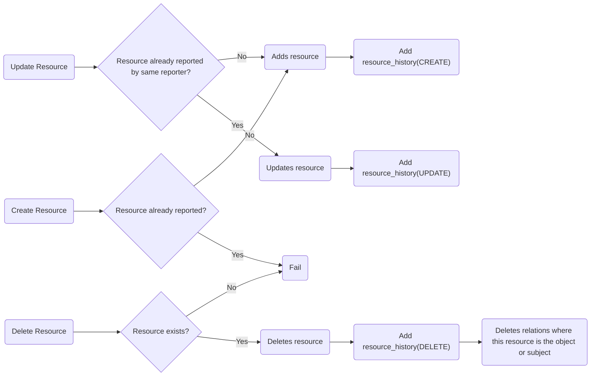
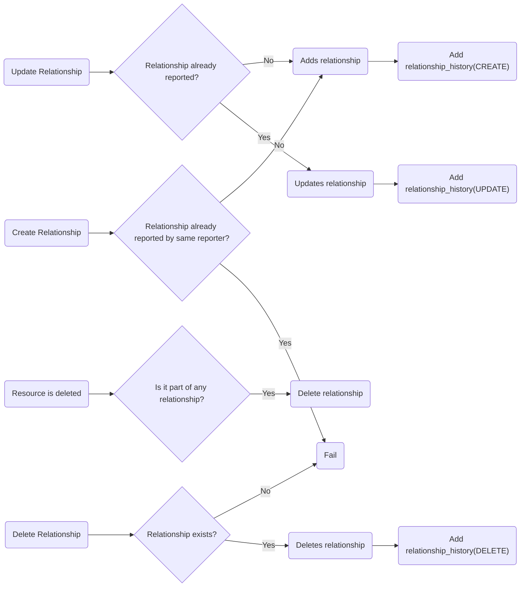

# Kessel Inventory

Kessel Inventory is a service that keeps track of resources (`rhel-host`, `k8s-policy`, `k8s-cluster`, `integrations`, etc)
and the relationships (distinct from Kessel Relations) between each resource (e.g., `k8s-policy` -- `is-propagated-to` --> `k8s-cluster`).

Each resource can contain internal information, such as cluster version, node details, severity, etc.

It relies on services reporting the status of each resource and relations between those.

To prevent services from having to save yet another id, Kessel Inventory will accept the reporter's resource id in lieu
of any id that is stored in Kessel Inventory's database. As such, API calls that address a particular resource 
will require the following tuple to identify a resource:
- `local_resource_id` - Id of the resource used by the reporter.
- `resource_type` - Resource type as identified by Kessel Inventory. e.g., `rhel-host`, `integrations`, `k8s-cluster`, etc.
- `reporter_id` - Id of the reporter.
- `reporter_type` - Type of reporter. e.g., `OCM`, 'ACM', 'HBI', etc.

## Persistence

Resources and relationships are saved in a SQL database, with the specifics of each resource stored as a JSON blob.

The primary tables are `resources` and `relationships` where we store the resources and relationships data 
respectively. Each of these tables has a corresponding `_history` table where changes are stored, along with the operation that triggered the event. 

Lastly, we have the `local_to_inventory_id` table that maps a reporter's resource identifier to an id used in the database.

### Database diagram

An Entity-Relationship diagram is provided below. 

Note: Entities ResourceReporter and RelationshipReporter are actually attributes in JSON format of other entities and not an entity on its own.

## Resources Lifecycle

Inventory keeps the latest data for a resource, but it also keeps a history of the changes.

When a resource is created, a new entry is added to the `resource_history` table, indicating the operation as `CREATE`.

The operation type (`CREATE`, `UPDATE` or `DELETE`) corresponds to the action taken on the resource.
Each entry in the `resource_history` may be deleted once it reach a certain time. 

### Resource lifecycle diagram

### Relationship lifecycle

The lifecycle of a relationship is similar to a resource, as there is a history table where changes on the relationship are tracked.
It follows the same approach, indicating operations (`CREATE`, `UPDATE` and `DELETE`).
Note that when a resource is deleted, any associated relationships are also removed; however, no entry is made in the history table for these deletions.

### Relationship lifecycle diagram

