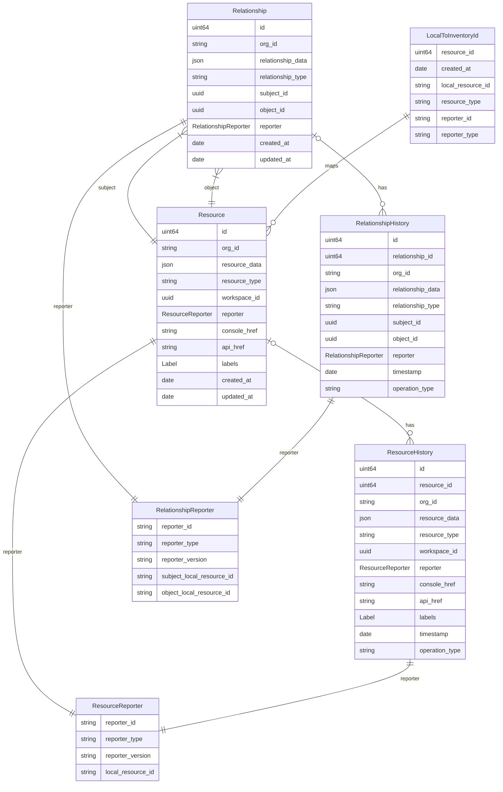
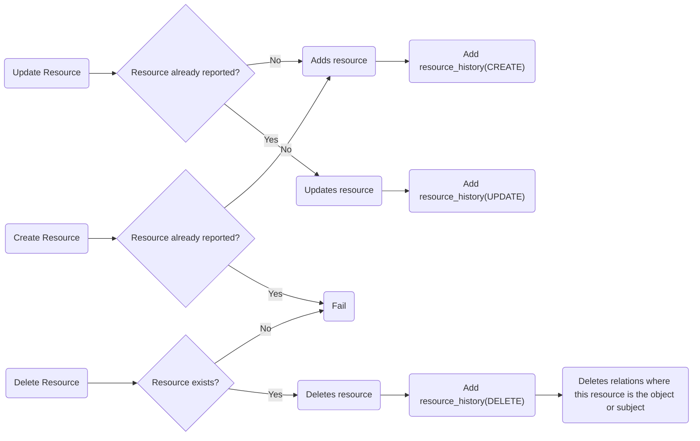

# Kessel Inventory

Kessel Inventory is a service that keeps tracks of resources (`rhel-host`, `k8s-policy`, `k8s-cluster`, `integrations`, etc) 
and the relationships (not to be confused with Kessel Relations) between each resource (e.g. `k8s-policy` -- `is-propagated-to` --> `k8s-cluster`).

Each resource can contain information about its internal, such as the version of the cluster, information about the nodes, severity, etc

It relies on services reporting the status of each resource and relations between those.

To prevent services from having to save yet another id, Kessel Inventory will accept the reporter's resource id in lieu
of any id that is stored in Kessel Inventory's database. As such, API calls that address a particular resource 
will require the following tuple to identify a resource:
- `local_resource_id`
- `resource_type`
- `reporter_id`
- `reporter_type`

## Persistence

Resources and relationships are saved in a SQL database, having the specifics of each resource stored as JSON blob.

The two principal tables are `resources` and `relationships` where we store the resources and relationships data 
respectively. Each of these tables has a `_history` table, where the history of changes is being saved along the operation
that triggered that event. 

Lastly, we have the `local_to_inventory_id` table that maps a reporter's resource identifier to an id used in the database.

### Database diagram

An Entity-Relationship diagram is provided below. 

Note: Entities ResourceReporter and RelationshipReporter are actually attributes in JSON format of other entities and not an entity on its own.

## Resources Lifecycle

Inventory keeps the latest data for a resource, but it also keeps a history of the changes.

When a resource is created, a new entry on the `resource_history` table is also created, indicated that the operation
is `CREATE`.

This value will match the operation that affected the result (`CREATE`, `UPDATE` or `DELETE`).
Each entry in the `resource_history` may be deleted once it reach a certain time. 

### Resource lifecycle diagram

### Relationship lifecycle

The lifecycle of a relationship is similar to a resource, as there is a history table where changes on the relationship are tracked.
It follows the same approach of indicating the operation (`CREATE`, `UPDATE` and `DELETE`). 
Note than when a resource is deleted, the relationship is also deleted, but without updating the history table for that.

### Relationship lifecycle diagram

